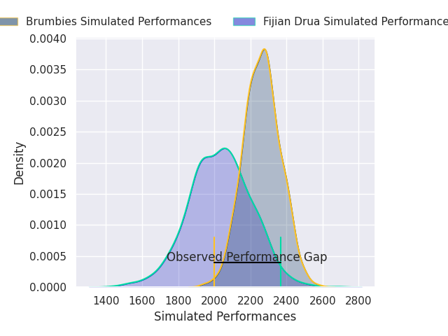
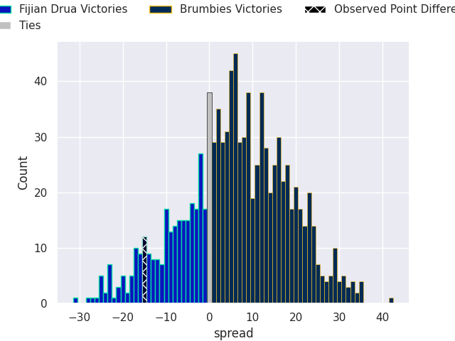

# Fijian Drua V Brumbies on 2026/03/13, 42.0 to 27.0

# Club Level Predictions

Now that the game has been played, lets see how the club predictions did. I predicted Brumbies to win by 6.1, and Fijian Drua won by 15.0. That's an absolute error of 21.1 for the margin of victory, while my average absolute error has been 13.3 over the past six months. This prediction was more accurate than 20.7% of my recent predictions.

For the Over/Under model, I predicted a total of 49.5 and we have an actual total of 69.0. That's an absolute error of 19.5 compared to a six month average of 13.2. This prediction was more accurate than 23.7% of my recent predictions.
## Projected Performances - Club Model

## Projected Spreads - Club Model

## Projected Results - Club Model

