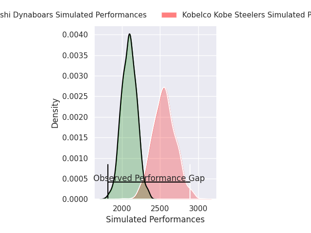
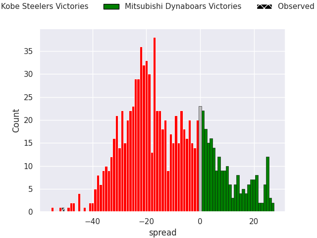
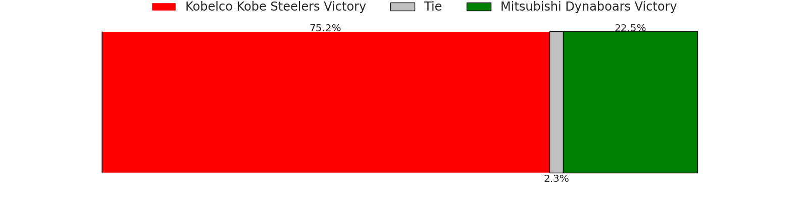

# Kobelco Kobe Steelers V Mitsubishi Dynaboars on 2026/03/14, 61.0 to 10.0

# Club Level Predictions

Now that the game has been played, lets see how the club predictions did. I predicted Kobelco Kobe Steelers to win by 12.21, and Kobelco Kobe Steelers won by 51.0. That's an absolute error of 38.8 for the margin of victory, while my average absolute error has been 13.3 over the past six months. This prediction was more accurate than 4.4% of my recent predictions.

For the Over/Under model, I predicted a total of 55.5 and we have an actual total of 71.0. That's an absolute error of 15.5 compared to a six month average of 13.2. This prediction was more accurate than 34.4% of my recent predictions.
## Projected Performances - Club Model

## Projected Spreads - Club Model

## Projected Results - Club Model

