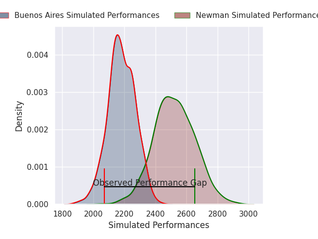
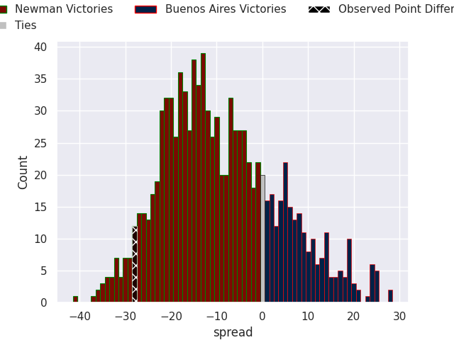

# Newman V Buenos Aires on 2026/03/14, 31.0 to 3.0

# Club Level Predictions

Now that the game has been played, lets see how the club predictions did. I predicted Newman to win by 9.14, and Newman won by 28.0. That's an absolute error of 18.9 for the margin of victory, while my average absolute error has been 13.4 over the past six months. This prediction was more accurate than 25.0% of my recent predictions.

For the Over/Under model, I predicted a total of 48.5 and we have an actual total of 34.0. That's an absolute error of 14.5 compared to a six month average of 13.2. This prediction was more accurate than 37.8% of my recent predictions.
## Projected Performances - Club Model

## Projected Spreads - Club Model

## Projected Results - Club Model

