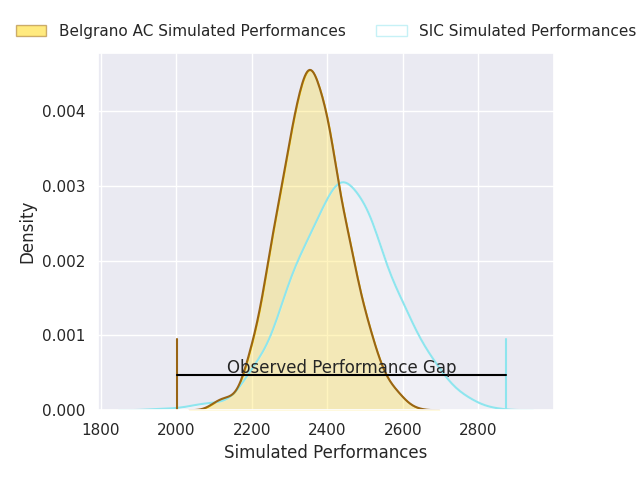
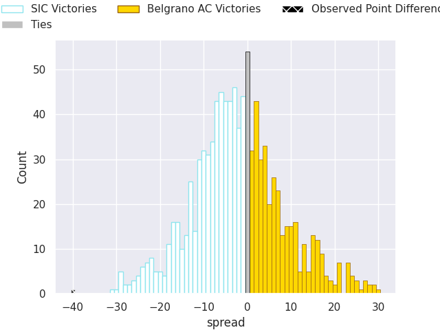

# SIC V Belgrano AC on 2026/03/14, 58.0 to 18.0

# Club Level Predictions

Now that the game has been played, lets see how the club predictions did. I predicted SIC to win by 2.19, and SIC won by 40.0. That's an absolute error of 37.8 for the margin of victory, while my average absolute error has been 13.4 over the past six months. This prediction was more accurate than 4.7% of my recent predictions.

For the Over/Under model, I predicted a total of 50.5 and we have an actual total of 76.0. That's an absolute error of 25.5 compared to a six month average of 13.2. This prediction was more accurate than 13.0% of my recent predictions.
## Projected Performances - Club Model

## Projected Spreads - Club Model

## Projected Results - Club Model

