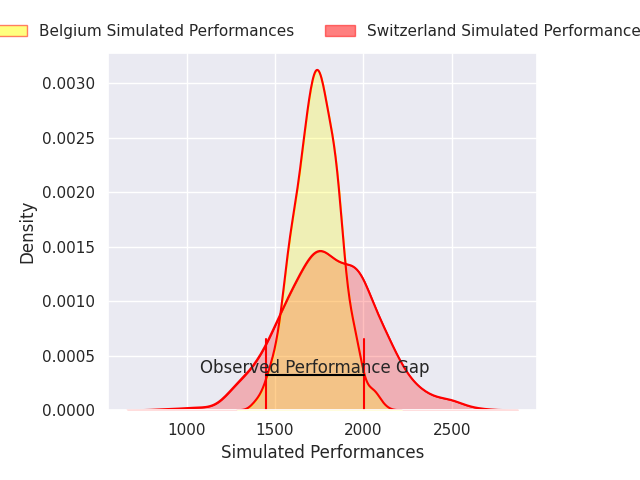
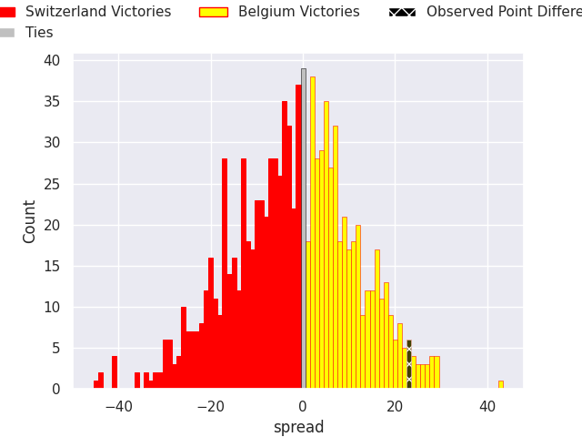

# Switzerland V Belgium on 2026/03/15, 16.0 to 39.0

# Club Level Predictions

Now that the game has been played, lets see how the club predictions did. I predicted Switzerland to win by 2.05, and Belgium won by 23.0. That's an absolute error of 25.0 for the margin of victory, while my average absolute error has been 13.3 over the past six months. This prediction was more accurate than 14.6% of my recent predictions.

For the Over/Under model, I predicted a total of 63.5 and we have an actual total of 55.0. That's an absolute error of 8.5 compared to a six month average of 13.2. This prediction was more accurate than 59.7% of my recent predictions.
## Projected Performances - Club Model

## Projected Spreads - Club Model

## Projected Results - Club Model

