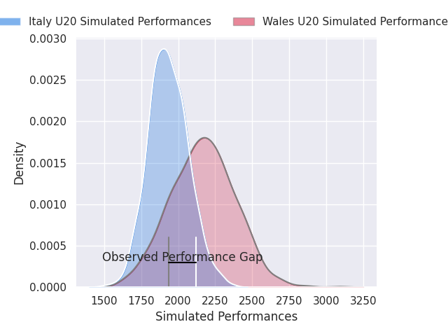
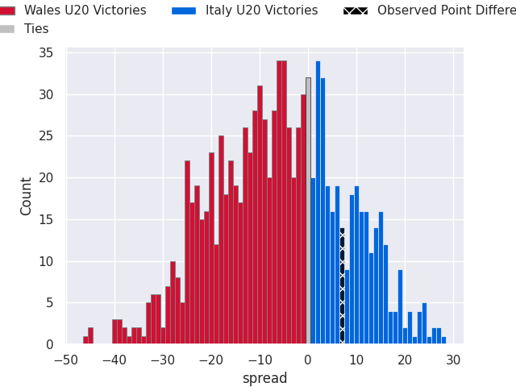

# Wales U20 V Italy U20 on 2026/03/15, 13.0 to 20.0

# Club Level Predictions

Now that the game has been played, lets see how the club predictions did. I predicted Wales U20 to win by 5.98, and Italy U20 won by 7.0. That's an absolute error of 13.0 for the margin of victory, while my average absolute error has been 13.3 over the past six months. This prediction was more accurate than 40.2% of my recent predictions.

For the Over/Under model, I predicted a total of 49.5 and we have an actual total of 33.0. That's an absolute error of 16.5 compared to a six month average of 13.2. This prediction was more accurate than 31.1% of my recent predictions.
## Projected Performances - Club Model

## Projected Spreads - Club Model

## Projected Results - Club Model

