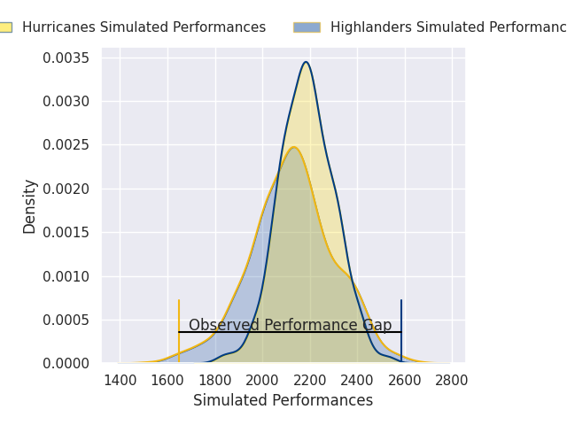
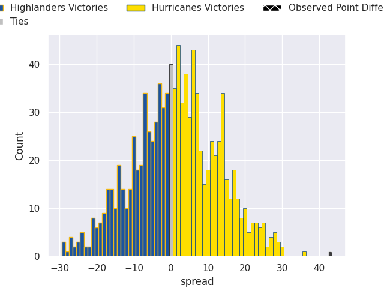

# Highlanders V Hurricanes on 2026/03/20, 7.0 to 50.0

# Club Level Predictions

Now that the game has been played, lets see how the club predictions did. I predicted Hurricanes to win by 1.46, and Hurricanes won by 43.0. That's an absolute error of 41.5 for the margin of victory, while my average absolute error has been 13.4 over the past six months. This prediction was more accurate than 3.4% of my recent predictions.

For the Over/Under model, I predicted a total of 49.5 and we have an actual total of 57.0. That's an absolute error of 7.5 compared to a six month average of 13.2. This prediction was more accurate than 63.4% of my recent predictions.
## Projected Performances - Club Model

## Projected Spreads - Club Model

## Projected Results - Club Model

