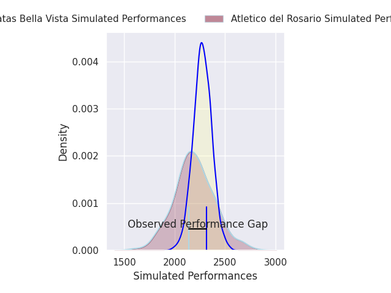
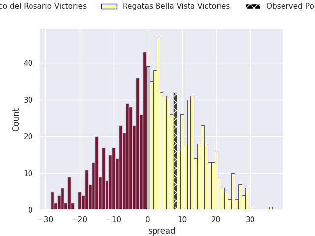

# Atlético del Rosario V Regatas Bella Vista on 2026/03/21, 12.0 to 20.0

# Club Level Predictions

Now that the game has been played, lets see how the club predictions did. I predicted Regatas Bella Vista to win by 2.24, and Regatas Bella Vista won by 8.0. That's an absolute error of 5.8 for the margin of victory, while my average absolute error has been 13.5 over the past six months. This prediction was more accurate than 70.2% of my recent predictions.

For the Over/Under model, I predicted a total of 48.5 and we have an actual total of 32.0. That's an absolute error of 16.5 compared to a six month average of 13.2. This prediction was more accurate than 31.6% of my recent predictions.
## Projected Performances - Club Model

## Projected Spreads - Club Model

## Projected Results - Club Model

