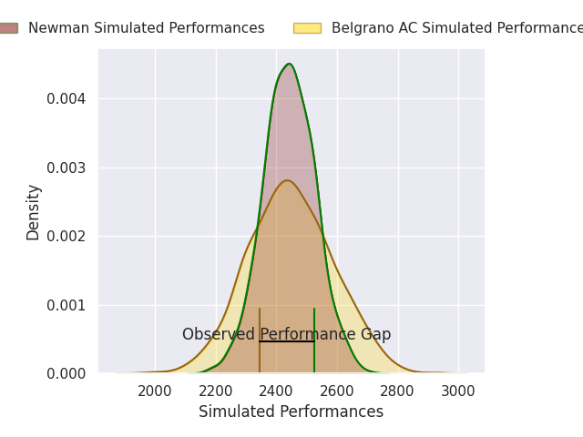
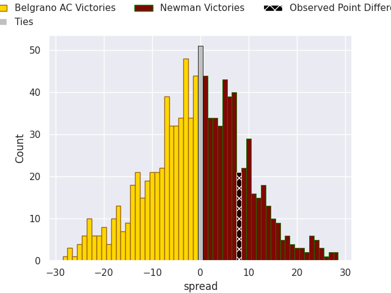

# Belgrano AC V Newman on 2026/03/21, 25.0 to 33.0

# Club Level Predictions

Now that the game has been played, lets see how the club predictions did. I predicted Belgrano AC to win by 0.56, and Newman won by 8.0. That's an absolute error of 8.6 for the margin of victory, while my average absolute error has been 13.4 over the past six months. This prediction was more accurate than 56.1% of my recent predictions.

For the Over/Under model, I predicted a total of 50.5 and we have an actual total of 58.0. That's an absolute error of 7.5 compared to a six month average of 13.3. This prediction was more accurate than 63.2% of my recent predictions.
## Projected Performances - Club Model

## Projected Spreads - Club Model

## Projected Results - Club Model

