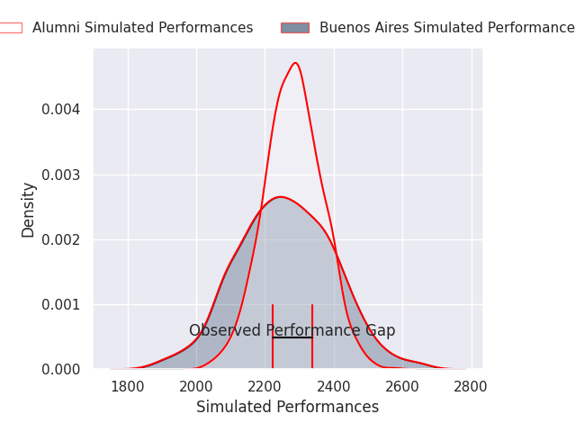
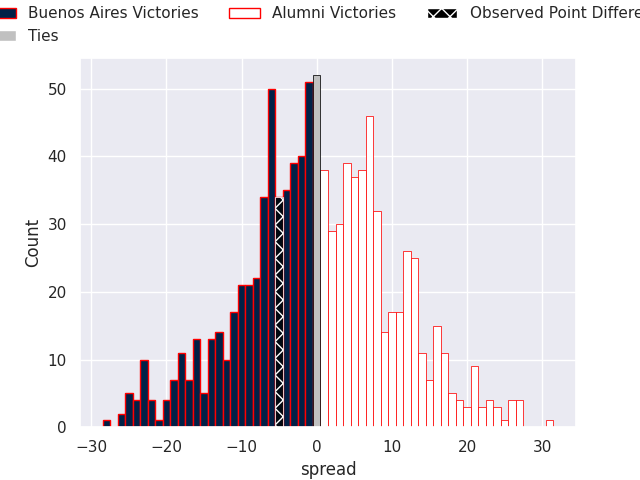

# Buenos Aires V Alumni on 2026/03/21, 20.0 to 15.0

# Club Level Predictions

Now that the game has been played, lets see how the club predictions did. I predicted Alumni to win by 0.26, and Buenos Aires won by 5.0. That's an absolute error of 5.3 for the margin of victory, while my average absolute error has been 13.5 over the past six months. This prediction was more accurate than 73.6% of my recent predictions.

For the Over/Under model, I predicted a total of 47.5 and we have an actual total of 35.0. That's an absolute error of 12.5 compared to a six month average of 13.2. This prediction was more accurate than 43.9% of my recent predictions.
## Projected Performances - Club Model

## Projected Spreads - Club Model

## Projected Results - Club Model

