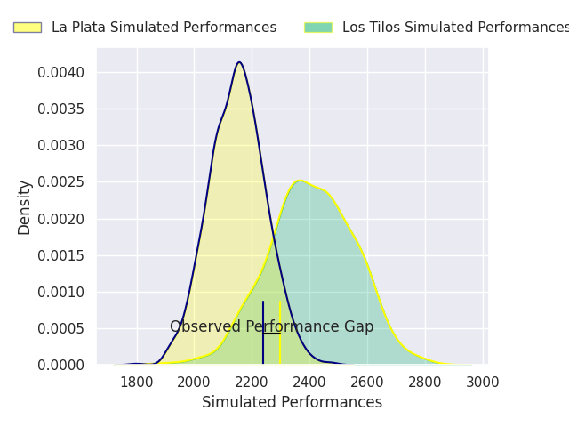
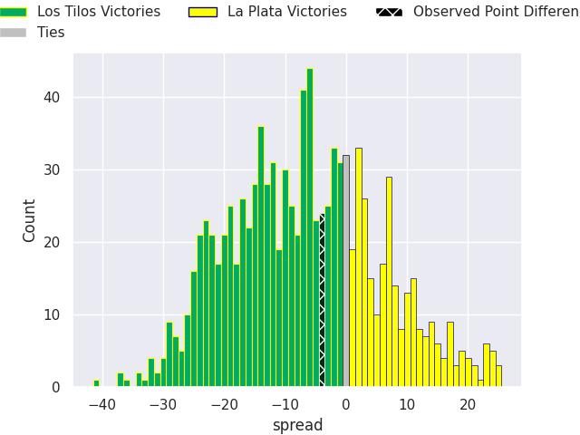

# Los Tilos V La Plata on 2026/03/21, 17.0 to 13.0

# Club Level Predictions

Now that the game has been played, lets see how the club predictions did. I predicted Los Tilos to win by 6.83, and Los Tilos won by 4.0. That's an absolute error of 2.8 for the margin of victory, while my average absolute error has been 13.4 over the past six months. This prediction was more accurate than 85.6% of my recent predictions.

For the Over/Under model, I predicted a total of 45.5 and we have an actual total of 30.0. That's an absolute error of 15.5 compared to a six month average of 13.3. This prediction was more accurate than 34.9% of my recent predictions.
## Projected Performances - Club Model

## Projected Spreads - Club Model

## Projected Results - Club Model

