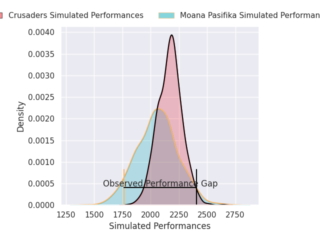
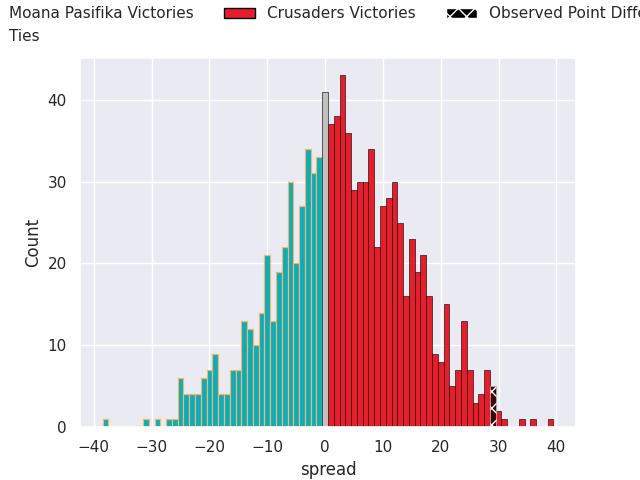

# Moana Pasifika V Crusaders on 2026/03/21, 21.0 to 50.0

# Club Level Predictions

Now that the game has been played, lets see how the club predictions did. I predicted Crusaders to win by 3.1, and Crusaders won by 29.0. That's an absolute error of 25.9 for the margin of victory, while my average absolute error has been 13.4 over the past six months. This prediction was more accurate than 14.2% of my recent predictions.

For the Over/Under model, I predicted a total of 52.5 and we have an actual total of 71.0. That's an absolute error of 18.5 compared to a six month average of 13.3. This prediction was more accurate than 26.7% of my recent predictions.
## Projected Performances - Club Model

## Projected Spreads - Club Model

## Projected Results - Club Model

