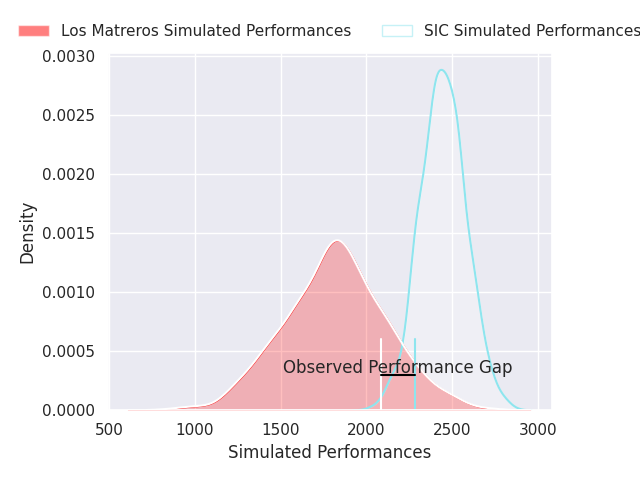
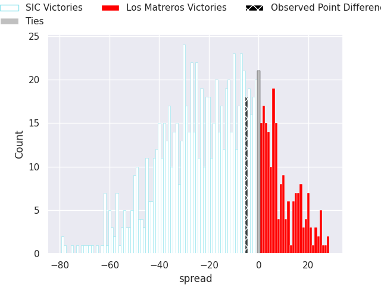
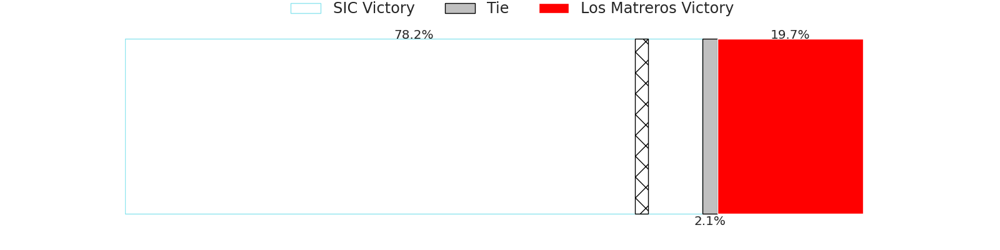

# SIC V Los Matreros on 2026/03/21, 25.0 to 20.0

# Club Level Predictions

Now that the game has been played, lets see how the club predictions did. I predicted SIC to win by 17.53, and SIC won by 5.0. That's an absolute error of 12.5 for the margin of victory, while my average absolute error has been 13.4 over the past six months. This prediction was more accurate than 41.5% of my recent predictions.

For the Over/Under model, I predicted a total of 50.5 and we have an actual total of 45.0. That's an absolute error of 5.5 compared to a six month average of 13.3. This prediction was more accurate than 73.4% of my recent predictions.
## Projected Performances - Club Model

## Projected Spreads - Club Model

## Projected Results - Club Model

