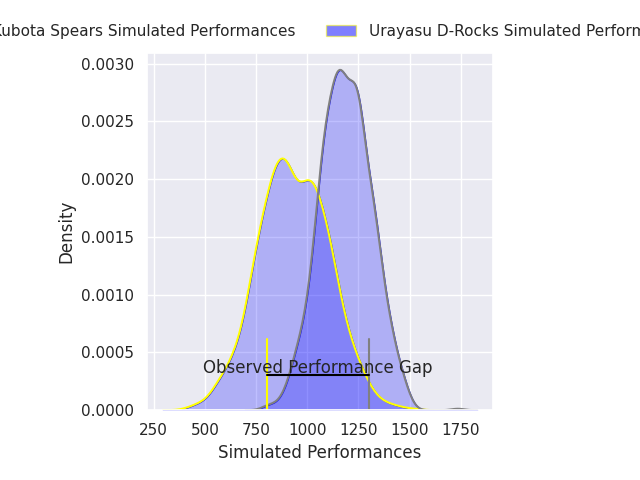
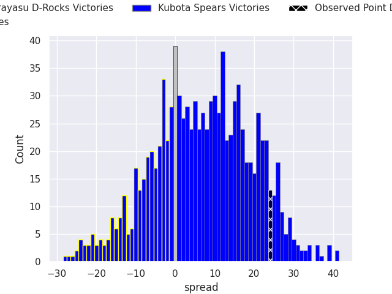
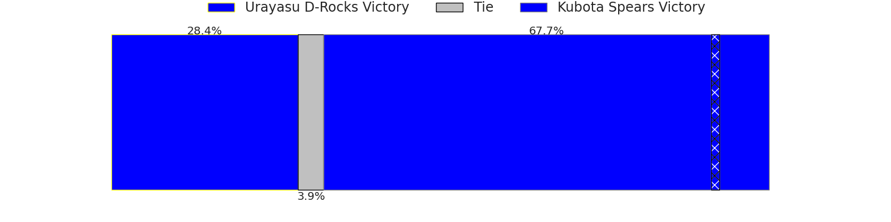

# Urayasu D-Rocks V Kubota Spears on 2026/03/21, 35.0 to 59.0

# Club Level Predictions

Now that the game has been played, lets see how the club predictions did. I predicted Kubota Spears to win by 10.62, and Kubota Spears won by 24.0. That's an absolute error of 13.4 for the margin of victory, while my average absolute error has been 13.4 over the past six months. This prediction was more accurate than 38.8% of my recent predictions.

For the Over/Under model, I predicted a total of 48.5 and we have an actual total of 94.0. That's an absolute error of 45.5 compared to a six month average of 13.3. This prediction was more accurate than 1.0% of my recent predictions.
## Projected Performances - Club Model

## Projected Spreads - Club Model

## Projected Results - Club Model

# Player Level Predictions

With the player model, I predicted Kubota Spears to win by 6.9,  and Kubota Spears won by 24.0. That's an absolute error of 17.1 for the margin of victory, while the average error as been 13.2 for the past six months. So this prediction was more accurate than 23.0% of my recent predictions.
## Projected Performances - Player Model

## Projected Spreads - Player Model

## Projected Results - Player Model

