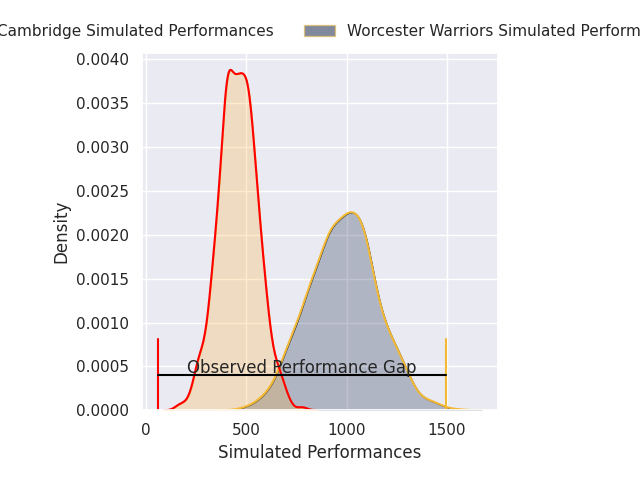
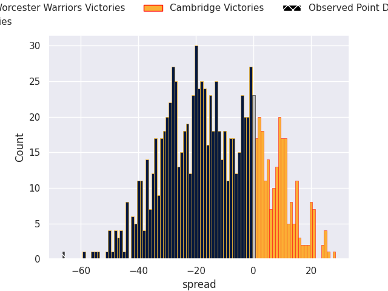

# Worcester Warriors V Cambridge on 2026/03/21, 76.0 to 10.0

# Club Level Predictions

Now that the game has been played, lets see how the club predictions did. I predicted Worcester Warriors to win by 12.46, and Worcester Warriors won by 66.0. That's an absolute error of 53.5 for the margin of victory, while my average absolute error has been 13.5 over the past six months. This prediction was more accurate than 0.9% of my recent predictions.

For the Over/Under model, I predicted a total of 52.5 and we have an actual total of 86.0. That's an absolute error of 33.5 compared to a six month average of 13.2. This prediction was more accurate than 3.8% of my recent predictions.
## Projected Performances - Club Model

## Projected Spreads - Club Model

## Projected Results - Club Model

# Player Level Predictions

With the player model, I predicted Worcester Warriors to win by 13.4,  and Worcester Warriors won by 66.0. That's an absolute error of 52.6 for the margin of victory, while the average error as been 13.2 for the past six months. So this prediction was more accurate than 0.8% of my recent predictions.
## Projected Performances - Player Model

## Projected Spreads - Player Model

## Projected Results - Player Model

