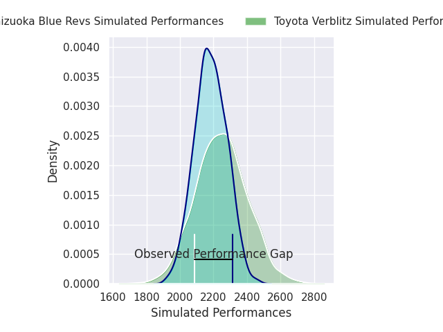
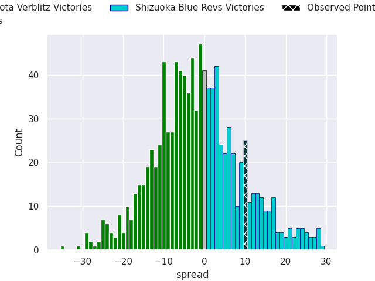

# Toyota Verblitz V Shizuoka Blue Revs on 2026/03/22, 24.0 to 34.0

# Club Level Predictions

Now that the game has been played, lets see how the club predictions did. I predicted Toyota Verblitz to win by 1.71, and Shizuoka Blue Revs won by 10.0. That's an absolute error of 11.7 for the margin of victory, while my average absolute error has been 13.5 over the past six months. This prediction was more accurate than 44.2% of my recent predictions.

For the Over/Under model, I predicted a total of 51.5 and we have an actual total of 58.0. That's an absolute error of 6.5 compared to a six month average of 13.2. This prediction was more accurate than 67.6% of my recent predictions.
## Projected Performances - Club Model

## Projected Spreads - Club Model

## Projected Results - Club Model

