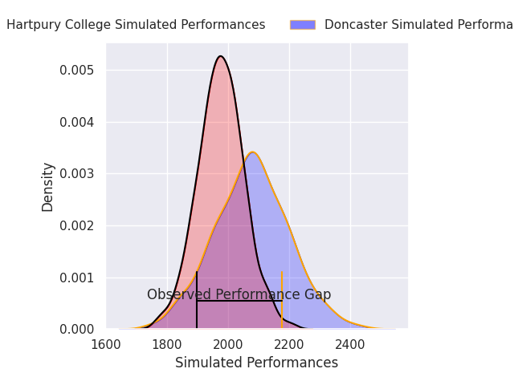
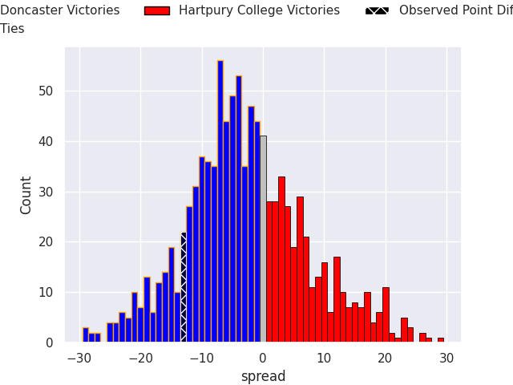

# Doncaster V Hartpury College on 2026/03/27, 35.0 to 22.0

# Club Level Predictions

Now that the game has been played, lets see how the club predictions did. I predicted Doncaster to win by 2.74, and Doncaster won by 13.0. That's an absolute error of 10.3 for the margin of victory, while my average absolute error has been 13.5 over the past six months. This prediction was more accurate than 50.3% of my recent predictions.

For the Over/Under model, I predicted a total of 46.5 and we have an actual total of 57.0. That's an absolute error of 10.5 compared to a six month average of 13.1. This prediction was more accurate than 50.9% of my recent predictions.
## Projected Performances - Club Model

## Projected Spreads - Club Model

## Projected Results - Club Model

