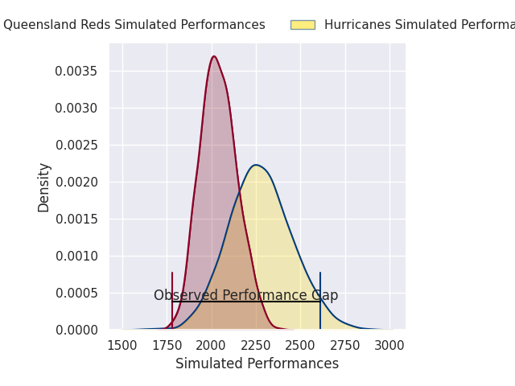
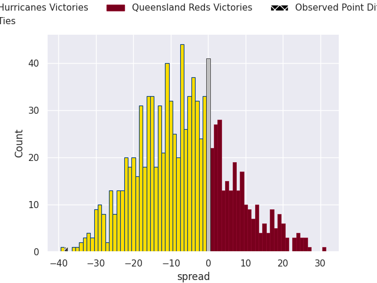

# Hurricanes V Queensland Reds on 2026/03/27, 52.0 to 14.0

# Club Level Predictions

Now that the game has been played, lets see how the club predictions did. I predicted Hurricanes to win by 6.57, and Hurricanes won by 38.0. That's an absolute error of 31.4 for the margin of victory, while my average absolute error has been 13.5 over the past six months. This prediction was more accurate than 8.8% of my recent predictions.

For the Over/Under model, I predicted a total of 47.5 and we have an actual total of 66.0. That's an absolute error of 18.5 compared to a six month average of 13.1. This prediction was more accurate than 26.5% of my recent predictions.
## Projected Performances - Club Model

## Projected Spreads - Club Model

## Projected Results - Club Model

