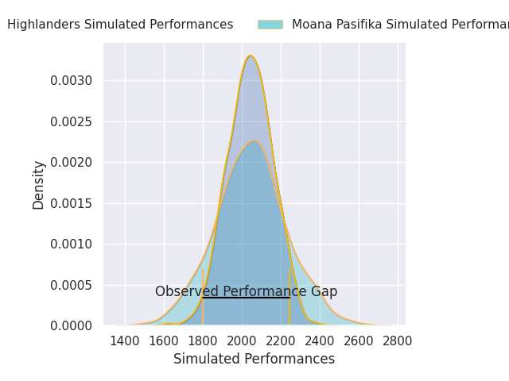
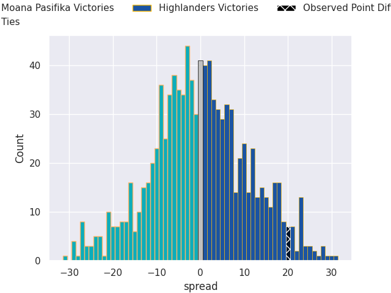

# Moana Pasifika V Highlanders on 2026/03/27, 19.0 to 39.0

# Club Level Predictions

Now that the game has been played, lets see how the club predictions did. I predicted Moana Pasifika to win by 0.06, and Highlanders won by 20.0. That's an absolute error of 20.1 for the margin of victory, while my average absolute error has been 13.5 over the past six months. This prediction was more accurate than 23.1% of my recent predictions.

For the Over/Under model, I predicted a total of 51.5 and we have an actual total of 58.0. That's an absolute error of 6.5 compared to a six month average of 13.2. This prediction was more accurate than 67.5% of my recent predictions.
## Projected Performances - Club Model

## Projected Spreads - Club Model

## Projected Results - Club Model

