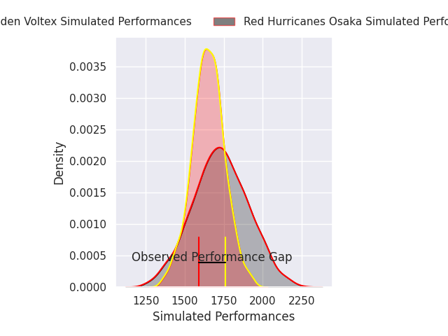
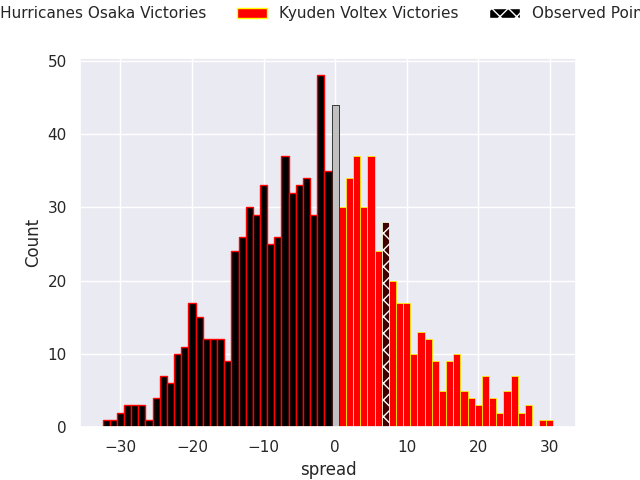

# Red Hurricanes Osaka V Kyuden Voltex on 2026/03/27, 24.0 to 31.0

# Club Level Predictions

Now that the game has been played, lets see how the club predictions did. I predicted Red Hurricanes Osaka to win by 2.45, and Kyuden Voltex won by 7.0. That's an absolute error of 9.4 for the margin of victory, while my average absolute error has been 13.5 over the past six months. This prediction was more accurate than 52.7% of my recent predictions.

For the Over/Under model, I predicted a total of 42.5 and we have an actual total of 55.0. That's an absolute error of 12.5 compared to a six month average of 13.2. This prediction was more accurate than 43.8% of my recent predictions.
## Projected Performances - Club Model

## Projected Spreads - Club Model

## Projected Results - Club Model

