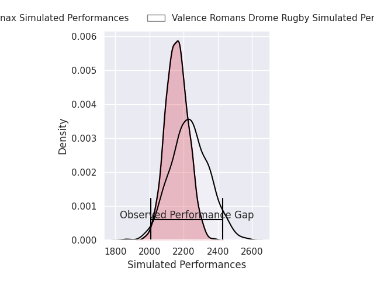
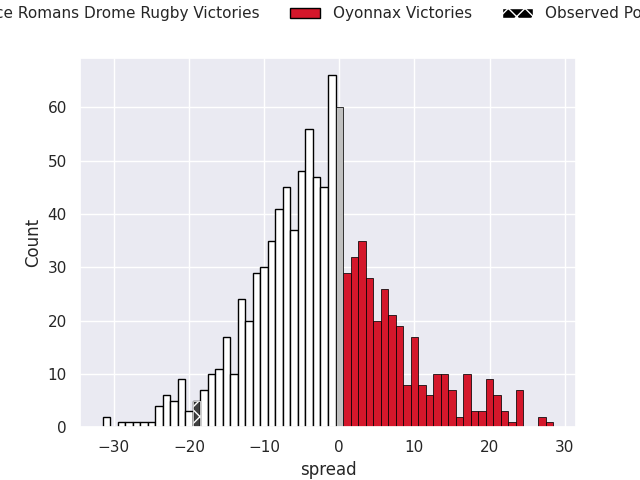
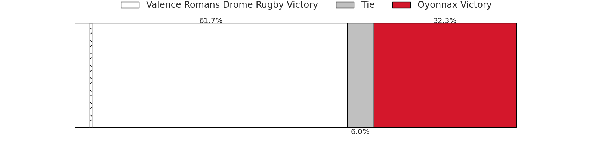
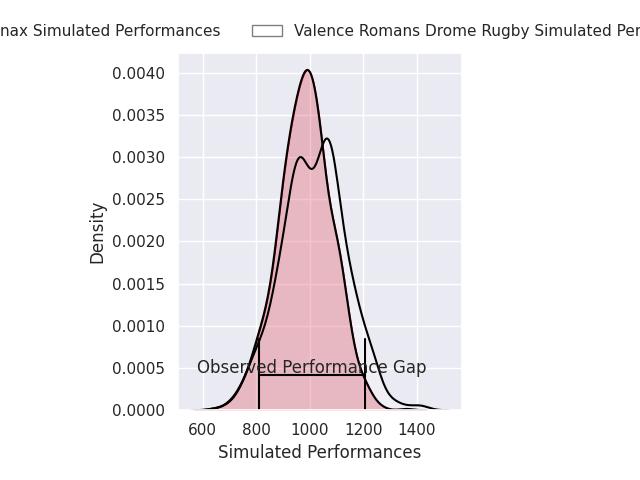
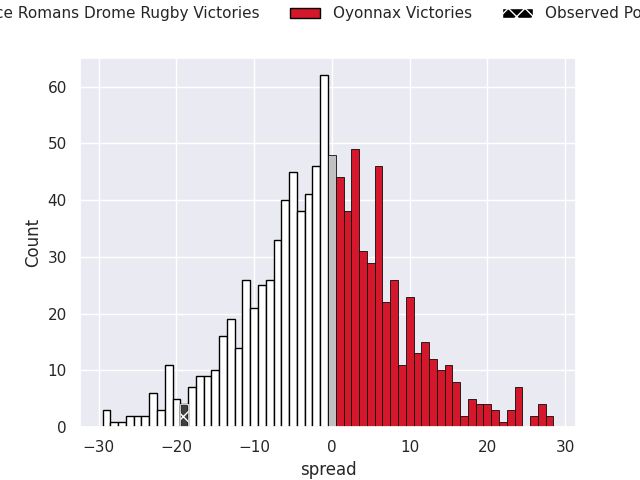
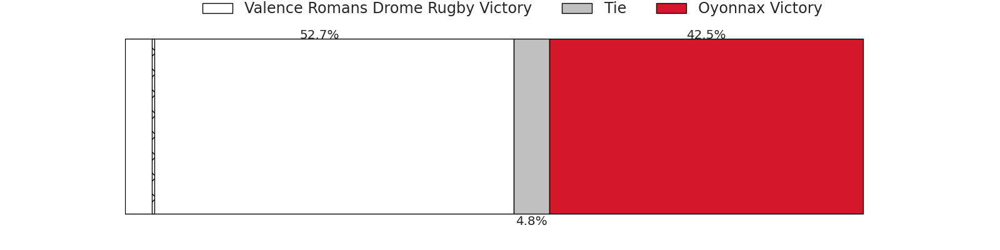

# Valence Romans Drome Rugby V Oyonnax on 2026/03/27, 40.0 to 21.0

# Club Level Predictions

Now that the game has been played, lets see how the club predictions did. I predicted Valence Romans Drome Rugby to win by 2.26, and Valence Romans Drome Rugby won by 19.0. That's an absolute error of 16.7 for the margin of victory, while my average absolute error has been 13.5 over the past six months. This prediction was more accurate than 29.2% of my recent predictions.

For the Over/Under model, I predicted a total of 48.5 and we have an actual total of 61.0. That's an absolute error of 12.5 compared to a six month average of 13.2. This prediction was more accurate than 43.8% of my recent predictions.
## Projected Performances - Club Model

## Projected Spreads - Club Model

## Projected Results - Club Model

# Player Level Predictions

With the player model, I predicted Valence Romans Drome Rugby to win by 0.94,  and Valence Romans Drome Rugby won by 19.0. That's an absolute error of 18.1 for the margin of victory, while the average error as been 13.2 for the past six months. So this prediction was more accurate than 21.5% of my recent predictions.
## Projected Performances - Player Model

## Projected Spreads - Player Model

## Projected Results - Player Model

