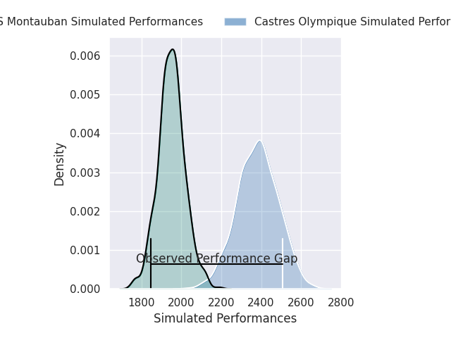
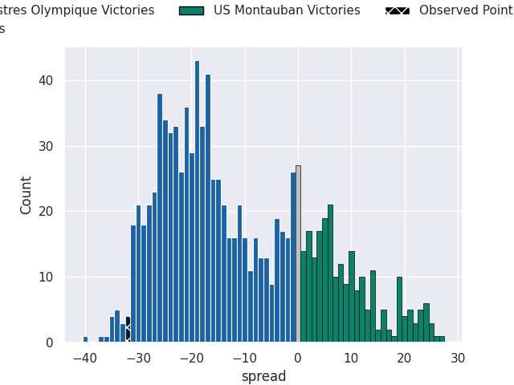
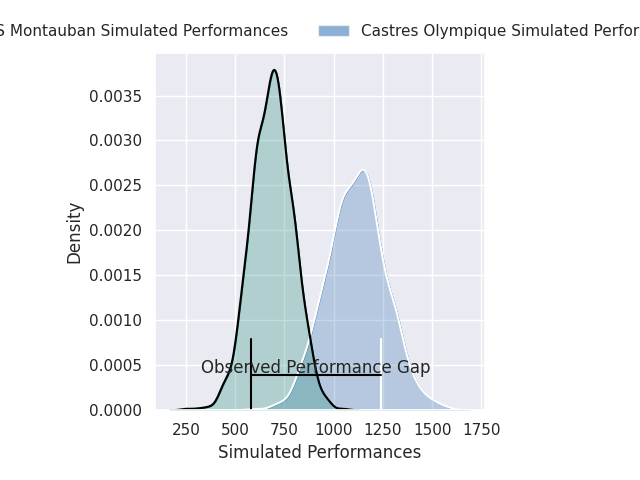
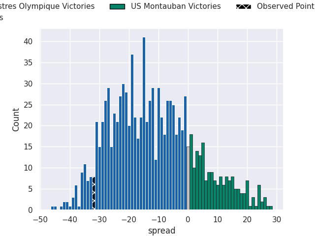
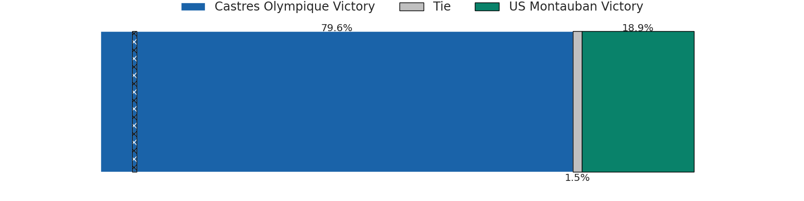

# Castres Olympique V US Montauban on 2026/03/28, 49.0 to 17.0

# Club Level Predictions

Now that the game has been played, lets see how the club predictions did. I predicted Castres Olympique to win by 11.26, and Castres Olympique won by 32.0. That's an absolute error of 20.7 for the margin of victory, while my average absolute error has been 13.5 over the past six months. This prediction was more accurate than 21.4% of my recent predictions.

For the Over/Under model, I predicted a total of 49.5 and we have an actual total of 66.0. That's an absolute error of 16.5 compared to a six month average of 13.1. This prediction was more accurate than 31.1% of my recent predictions.
## Projected Performances - Club Model

## Projected Spreads - Club Model

## Projected Results - Club Model

# Player Level Predictions

With the player model, I predicted Castres Olympique to win by 12.03,  and Castres Olympique won by 32.0. That's an absolute error of 20.0 for the margin of victory, while the average error as been 13.3 for the past six months. So this prediction was more accurate than 18.2% of my recent predictions.
## Projected Performances - Player Model

## Projected Spreads - Player Model

## Projected Results - Player Model

