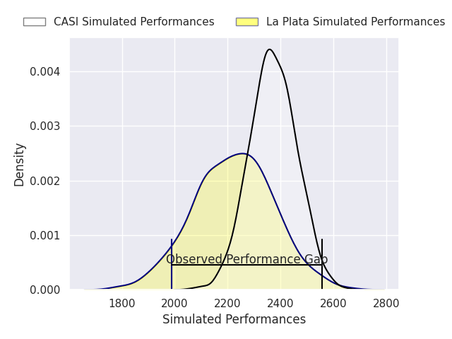
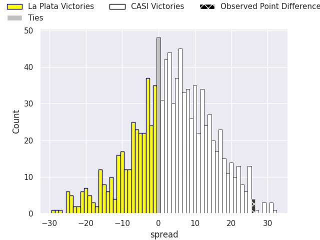
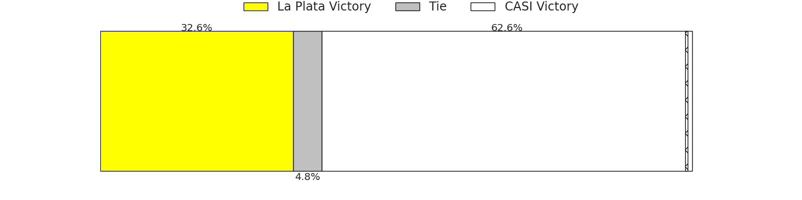

# La Plata V CASI on 2026/03/28, 13.0 to 39.0

# Club Level Predictions

Now that the game has been played, lets see how the club predictions did. I predicted CASI to win by 3.74, and CASI won by 26.0. That's an absolute error of 22.3 for the margin of victory, while my average absolute error has been 13.5 over the past six months. This prediction was more accurate than 19.7% of my recent predictions.

For the Over/Under model, I predicted a total of 46.5 and we have an actual total of 52.0. That's an absolute error of 5.5 compared to a six month average of 13.2. This prediction was more accurate than 73.2% of my recent predictions.
## Projected Performances - Club Model

## Projected Spreads - Club Model

## Projected Results - Club Model

