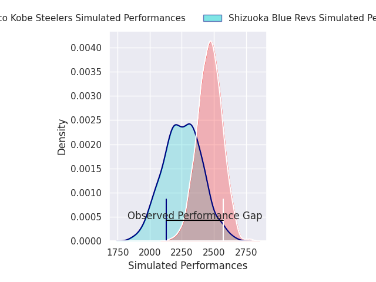
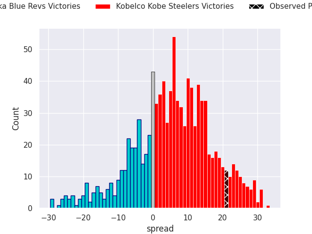
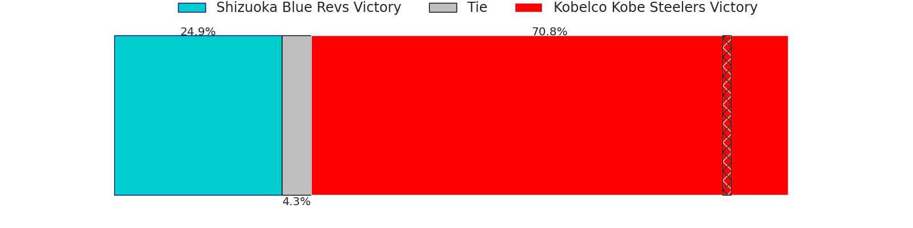

# Shizuoka Blue Revs V Kobelco Kobe Steelers on 2026/03/28, 20.0 to 41.0

# Club Level Predictions

Now that the game has been played, lets see how the club predictions did. I predicted Kobelco Kobe Steelers to win by 5.86, and Kobelco Kobe Steelers won by 21.0. That's an absolute error of 15.1 for the margin of victory, while my average absolute error has been 13.5 over the past six months. This prediction was more accurate than 33.9% of my recent predictions.

For the Over/Under model, I predicted a total of 54.5 and we have an actual total of 61.0. That's an absolute error of 6.5 compared to a six month average of 13.1. This prediction was more accurate than 67.7% of my recent predictions.
## Projected Performances - Club Model

## Projected Spreads - Club Model

## Projected Results - Club Model

