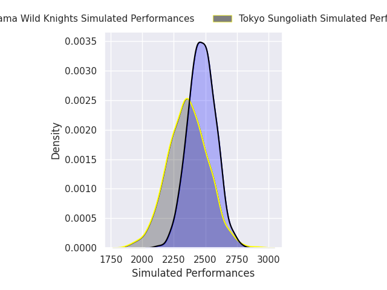
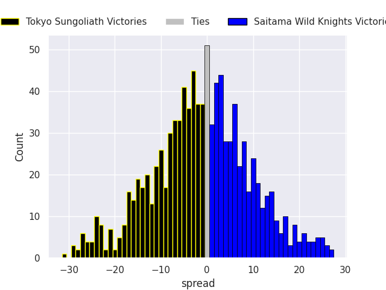
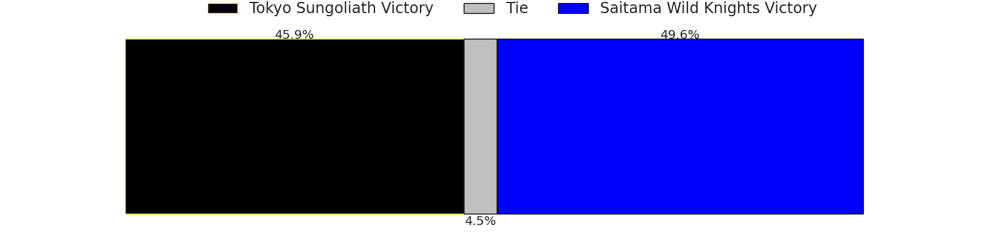
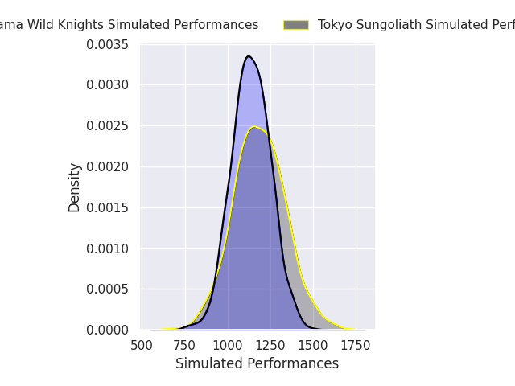
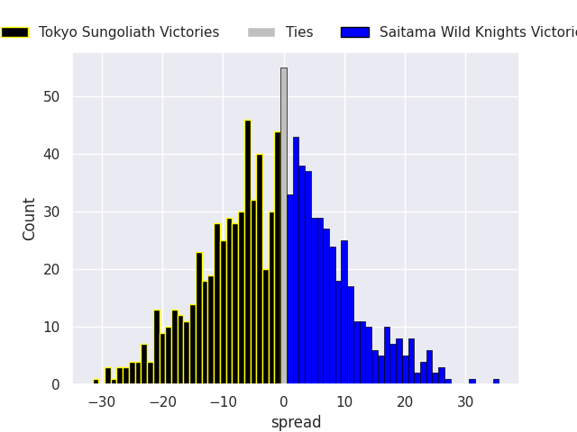
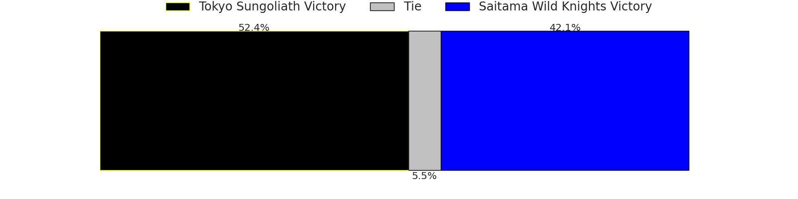

# Tokyo Sungoliath V Saitama Wild Knights on 2026/03/28, 34.0 to 36.0

# Club Level Predictions

Now that the game has been played, lets see how the club predictions did. I predicted Tokyo Sungoliath to win by 0.63, and Saitama Wild Knights won by 2.0. That's an absolute error of 2.6 for the margin of victory, while my average absolute error has been 13.5 over the past six months. This prediction was more accurate than 86.0% of my recent predictions.

For the Over/Under model, I predicted a total of 50.5 and we have an actual total of 70.0. That's an absolute error of 19.5 compared to a six month average of 13.1. This prediction was more accurate than 24.0% of my recent predictions.
## Projected Performances - Club Model

## Projected Spreads - Club Model

## Projected Results - Club Model

# Player Level Predictions

With the player model, I predicted Tokyo Sungoliath to win by 0.96,  and Saitama Wild Knights won by 2.0. That's an absolute error of 3.0 for the margin of victory, while the average error as been 13.3 for the past six months. So this prediction was more accurate than 70.6% of my recent predictions.
## Projected Performances - Player Model

## Projected Spreads - Player Model

## Projected Results - Player Model

