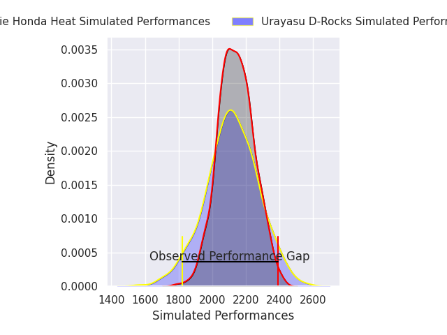
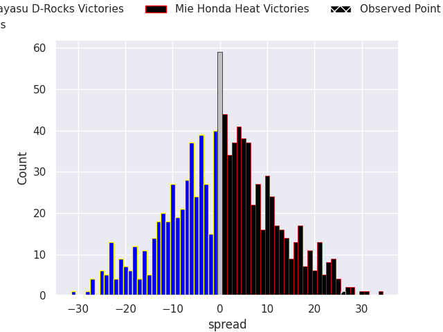
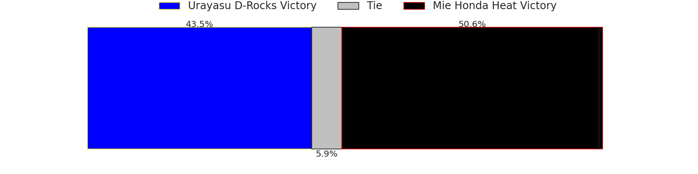
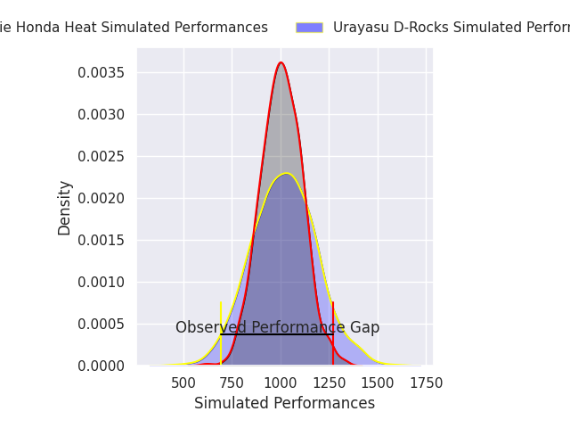
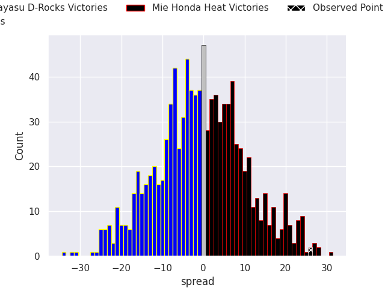
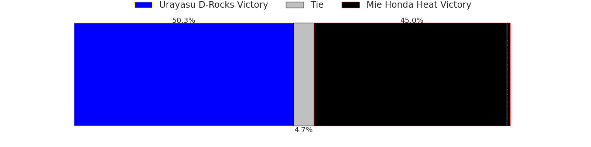

# Urayasu D-Rocks V Mie Honda Heat on 2026/03/29, 17.0 to 43.0

# Club Level Predictions

Now that the game has been played, lets see how the club predictions did. I predicted Mie Honda Heat to win by 0.55, and Mie Honda Heat won by 26.0. That's an absolute error of 25.4 for the margin of victory, while my average absolute error has been 13.5 over the past six months. This prediction was more accurate than 14.6% of my recent predictions.

For the Over/Under model, I predicted a total of 49.5 and we have an actual total of 60.0. That's an absolute error of 10.5 compared to a six month average of 13.1. This prediction was more accurate than 51.0% of my recent predictions.
## Projected Performances - Club Model

## Projected Spreads - Club Model

## Projected Results - Club Model

# Player Level Predictions

With the player model, I predicted Urayasu D-Rocks to win by 0.51,  and Mie Honda Heat won by 26.0. That's an absolute error of 26.5 for the margin of victory, while the average error as been 13.3 for the past six months. So this prediction was more accurate than 10.7% of my recent predictions.
## Projected Performances - Player Model

## Projected Spreads - Player Model

## Projected Results - Player Model

