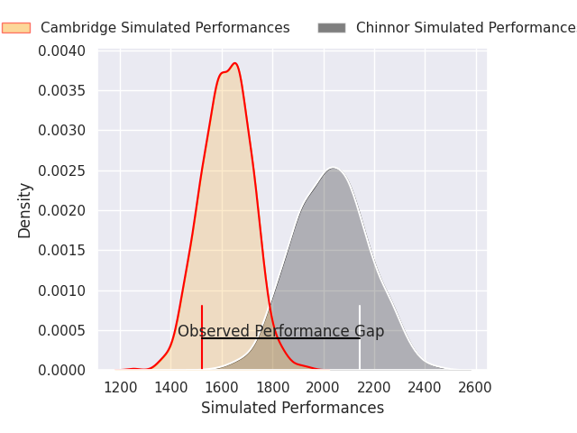
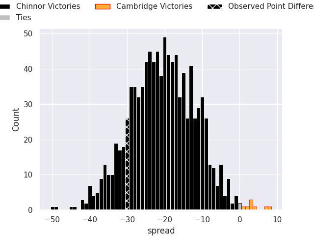

# Chinnor V Cambridge on 2026/04/03, 42.0 to 12.0

# Club Level Predictions

Now that the game has been played, lets see how the club predictions did. I predicted Chinnor to win by 20.49, and Chinnor won by 30.0. That's an absolute error of 9.5 for the margin of victory, while my average absolute error has been 13.5 over the past six months. This prediction was more accurate than 52.9% of my recent predictions.

For the Over/Under model, I predicted a total of 44.5 and we have an actual total of 54.0. That's an absolute error of 9.5 compared to a six month average of 13.1. This prediction was more accurate than 54.5% of my recent predictions.
## Projected Performances - Club Model

## Projected Spreads - Club Model

## Projected Results - Club Model

