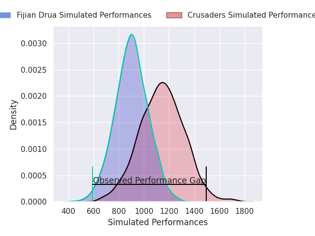
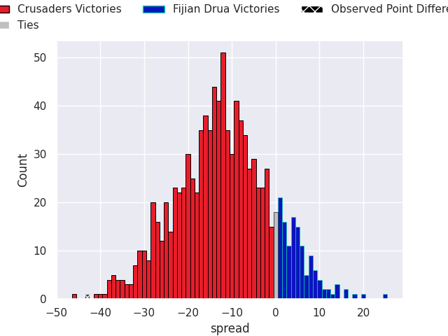
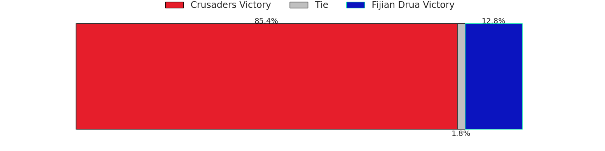

# Crusaders V Fijian Drua on 2026/04/03, 69.0 to 26.0

# Club Level Predictions

Now that the game has been played, lets see how the club predictions did. I predicted Crusaders to win by 17.13, and Crusaders won by 43.0. That's an absolute error of 25.9 for the margin of victory, while my average absolute error has been 13.5 over the past six months. This prediction was more accurate than 14.2% of my recent predictions.

For the Over/Under model, I predicted a total of 49.5 and we have an actual total of 95.0. That's an absolute error of 45.5 compared to a six month average of 13.1. This prediction was more accurate than 0.8% of my recent predictions.
## Projected Performances - Club Model

## Projected Spreads - Club Model

## Projected Results - Club Model

# Player Level Predictions

With the player model, I predicted Crusaders to win by 12.08,  and Crusaders won by 43.0. That's an absolute error of 30.9 for the margin of victory, while the average error as been 13.3 for the past six months. So this prediction was more accurate than 7.8% of my recent predictions.
## Projected Performances - Player Model

## Projected Spreads - Player Model

## Projected Results - Player Model

