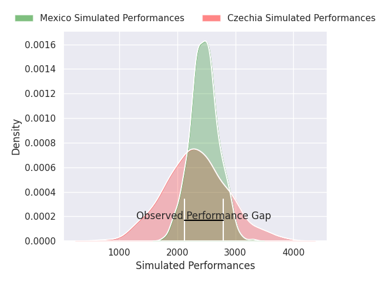
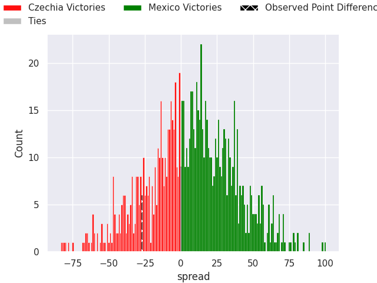

# Czechia V Mexico on 2026/04/03, 54.0 to 27.0

# Club Level Predictions

Now that the game has been played, lets see how the club predictions did. I predicted Mexico to win by 7.21, and Czechia won by 27.0. That's an absolute error of 34.2 for the margin of victory, while my average absolute error has been 13.7 over the past six months. This prediction was more accurate than 6.6% of my recent predictions.

For the Over/Under model, I predicted a total of 48.5 and we have an actual total of 81.0. That's an absolute error of 32.5 compared to a six month average of 13.2. This prediction was more accurate than 5.1% of my recent predictions.
## Projected Performances - Club Model

## Projected Spreads - Club Model

## Projected Results - Club Model

