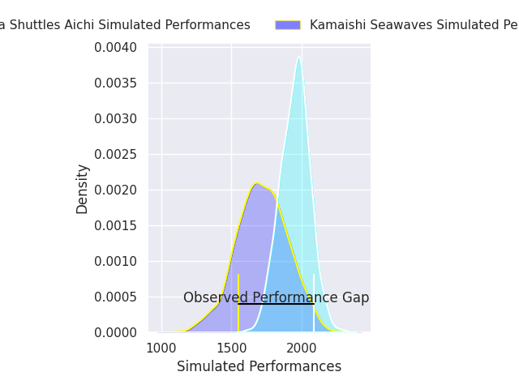
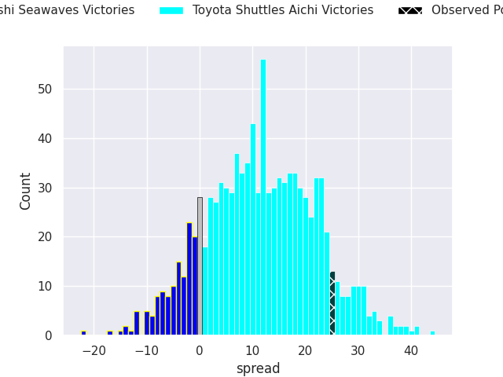
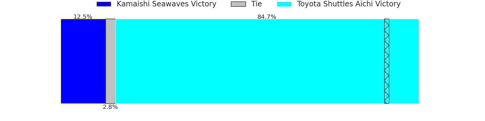
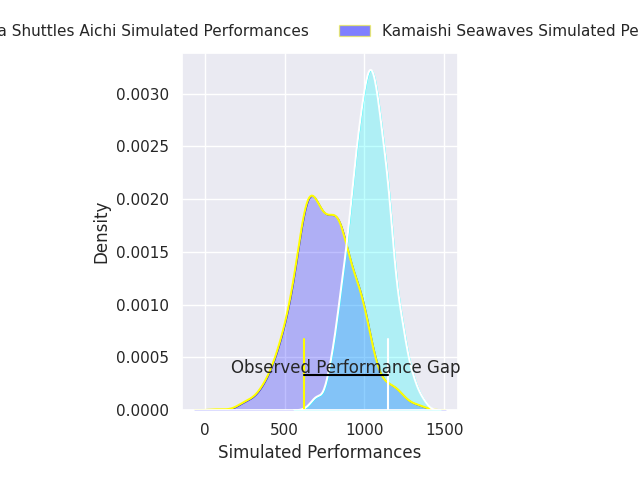
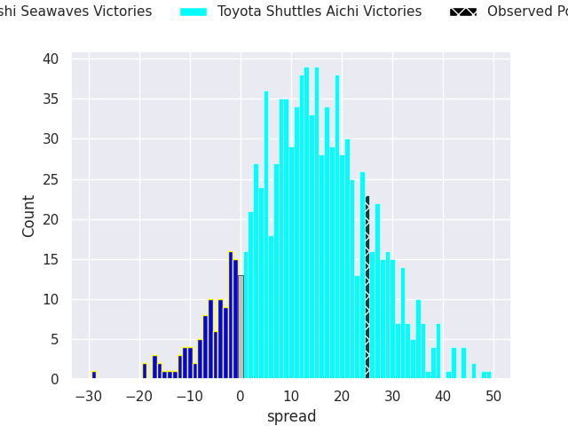
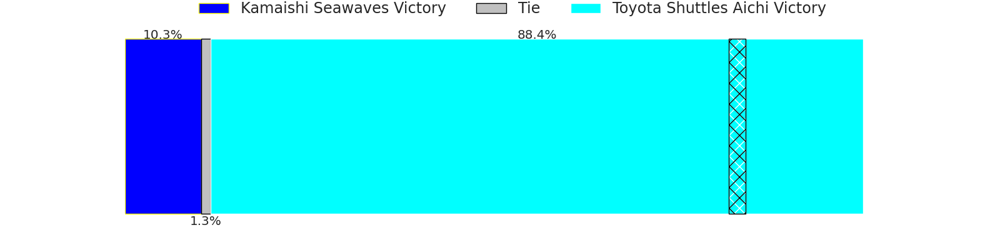

# Kamaishi Seawaves V Toyota Shuttles Aichi on 2026/04/03, 27.0 to 52.0

# Club Level Predictions

Now that the game has been played, lets see how the club predictions did. I predicted Toyota Shuttles Aichi to win by 11.62, and Toyota Shuttles Aichi won by 25.0. That's an absolute error of 13.4 for the margin of victory, while my average absolute error has been 13.7 over the past six months. This prediction was more accurate than 40.2% of my recent predictions.

For the Over/Under model, I predicted a total of 56.5 and we have an actual total of 79.0. That's an absolute error of 22.5 compared to a six month average of 13.2. This prediction was more accurate than 19.6% of my recent predictions.
## Projected Performances - Club Model

## Projected Spreads - Club Model

## Projected Results - Club Model

# Player Level Predictions

With the player model, I predicted Toyota Shuttles Aichi to win by 13.91,  and Toyota Shuttles Aichi won by 25.0. That's an absolute error of 11.1 for the margin of victory, while the average error as been 13.8 for the past six months. So this prediction was more accurate than 43.2% of my recent predictions.
## Projected Performances - Player Model

## Projected Spreads - Player Model

## Projected Results - Player Model

