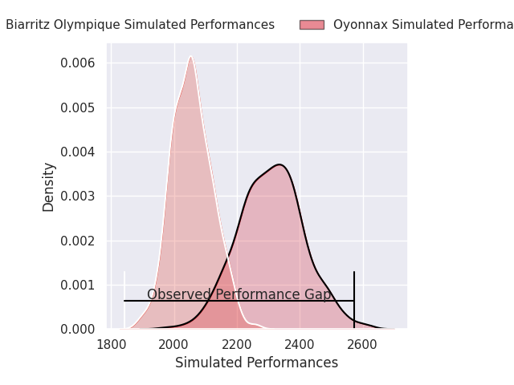
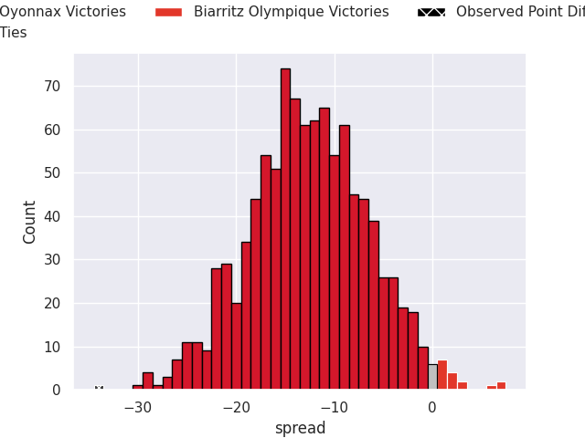
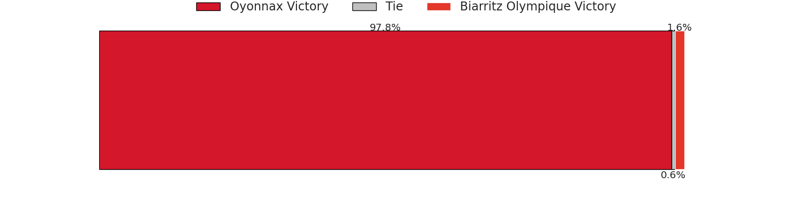
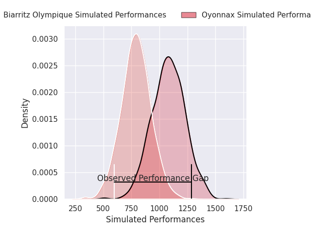
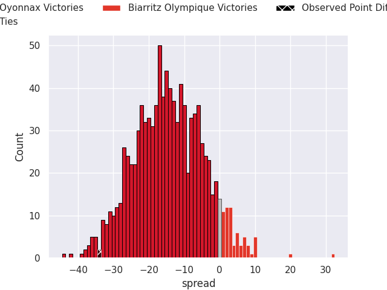
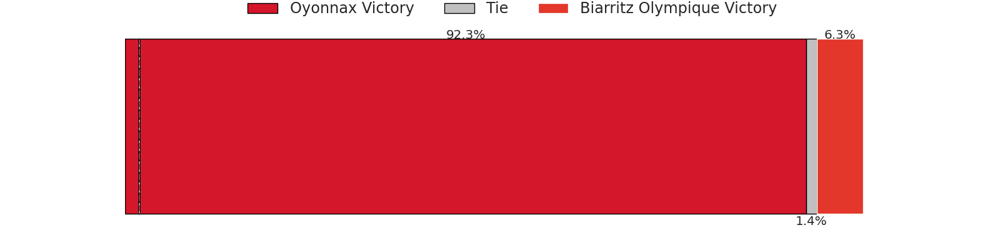

# Oyonnax V Biarritz Olympique on 2026/04/03, 48.0 to 14.0

# Club Level Predictions

Now that the game has been played, lets see how the club predictions did. I predicted Oyonnax to win by 12.57, and Oyonnax won by 34.0. That's an absolute error of 21.4 for the margin of victory, while my average absolute error has been 13.5 over the past six months. This prediction was more accurate than 20.6% of my recent predictions.

For the Over/Under model, I predicted a total of 48.5 and we have an actual total of 62.0. That's an absolute error of 13.5 compared to a six month average of 13.1. This prediction was more accurate than 40.0% of my recent predictions.
## Projected Performances - Club Model

## Projected Spreads - Club Model

## Projected Results - Club Model

# Player Level Predictions

With the player model, I predicted Oyonnax to win by 14.4,  and Oyonnax won by 34.0. That's an absolute error of 19.6 for the margin of victory, while the average error as been 13.3 for the past six months. So this prediction was more accurate than 18.7% of my recent predictions.
## Projected Performances - Player Model

## Projected Spreads - Player Model

## Projected Results - Player Model

