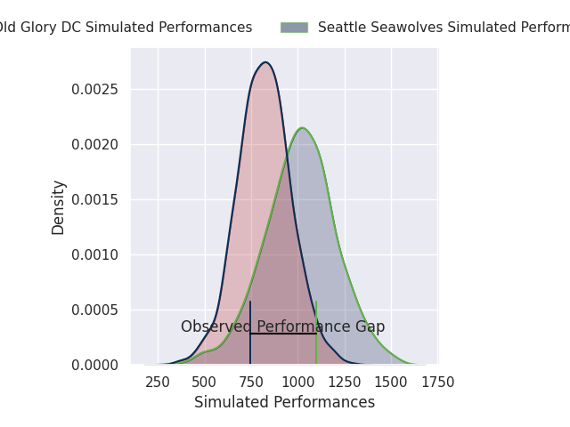
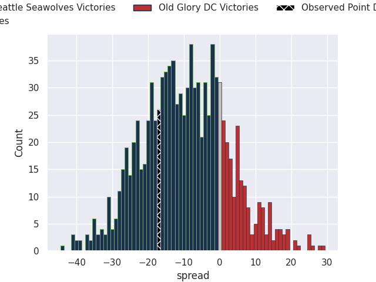
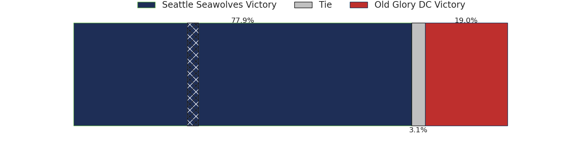

# Seattle Seawolves V Old Glory DC on 2026/04/03, 33.0 to 16.0

# Club Level Predictions

Now that the game has been played, lets see how the club predictions did. I predicted Seattle Seawolves to win by 9.25, and Seattle Seawolves won by 17.0. That's an absolute error of 7.8 for the margin of victory, while my average absolute error has been 13.7 over the past six months. This prediction was more accurate than 60.7% of my recent predictions.

For the Over/Under model, I predicted a total of 47.5 and we have an actual total of 49.0. That's an absolute error of 1.5 compared to a six month average of 13.2. This prediction was more accurate than 92.6% of my recent predictions.
## Projected Performances - Club Model

## Projected Spreads - Club Model

## Projected Results - Club Model

# Player Level Predictions

With the player model, I predicted Seattle Seawolves to win by 9.62,  and Seattle Seawolves won by 17.0. That's an absolute error of 7.4 for the margin of victory, while the average error as been 13.8 for the past six months. So this prediction was more accurate than 57.4% of my recent predictions.
## Projected Performances - Player Model

## Projected Spreads - Player Model

## Projected Results - Player Model

