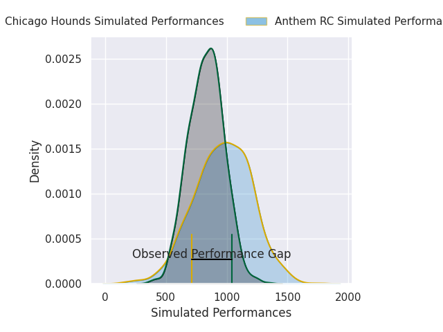
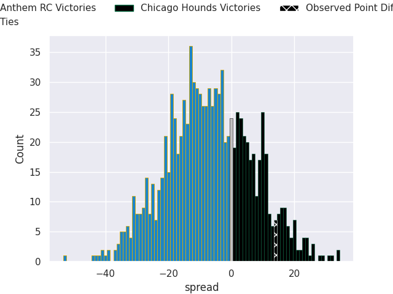
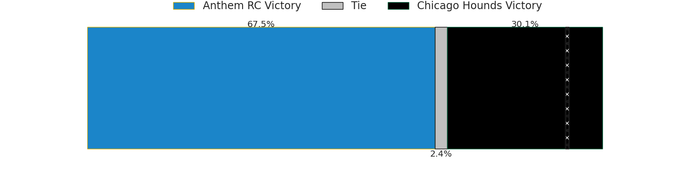

# Anthem RC V Chicago Hounds on 2026/04/04, 19.0 to 33.0

# Club Level Predictions

Now that the game has been played, lets see how the club predictions did. I predicted Chicago Hounds to win by 13.38, and Chicago Hounds won by 14.0. That's an absolute error of 0.6 for the margin of victory, while my average absolute error has been 13.5 over the past six months. This prediction was more accurate than 96.5% of my recent predictions.

For the Over/Under model, I predicted a total of 43.5 and we have an actual total of 52.0. That's an absolute error of 8.5 compared to a six month average of 13.1. This prediction was more accurate than 59.4% of my recent predictions.
## Projected Performances - Club Model

## Projected Spreads - Club Model

## Projected Results - Club Model

# Player Level Predictions

With the player model, I predicted Anthem RC to win by 6.86,  and Chicago Hounds won by 14.0. That's an absolute error of 20.9 for the margin of victory, while the average error as been 13.3 for the past six months. So this prediction was more accurate than 16.9% of my recent predictions.
## Projected Performances - Player Model

## Projected Spreads - Player Model

## Projected Results - Player Model

