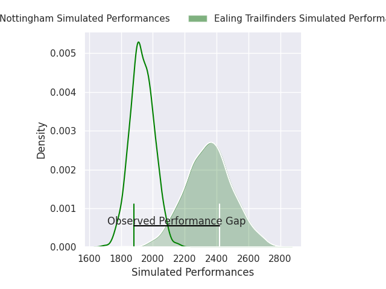
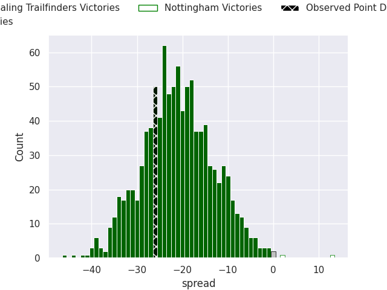

# Ealing Trailfinders V Nottingham on 2026/04/04, 47.0 to 21.0

# Club Level Predictions

Now that the game has been played, lets see how the club predictions did. I predicted Ealing Trailfinders to win by 20.96, and Ealing Trailfinders won by 26.0. That's an absolute error of 5.0 for the margin of victory, while my average absolute error has been 13.5 over the past six months. This prediction was more accurate than 75.2% of my recent predictions.

For the Over/Under model, I predicted a total of 50.5 and we have an actual total of 68.0. That's an absolute error of 17.5 compared to a six month average of 13.1. This prediction was more accurate than 28.6% of my recent predictions.
## Projected Performances - Club Model

## Projected Spreads - Club Model

## Projected Results - Club Model

