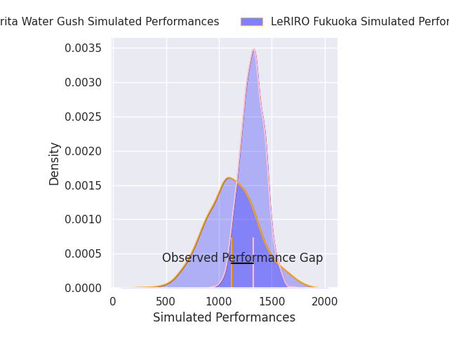
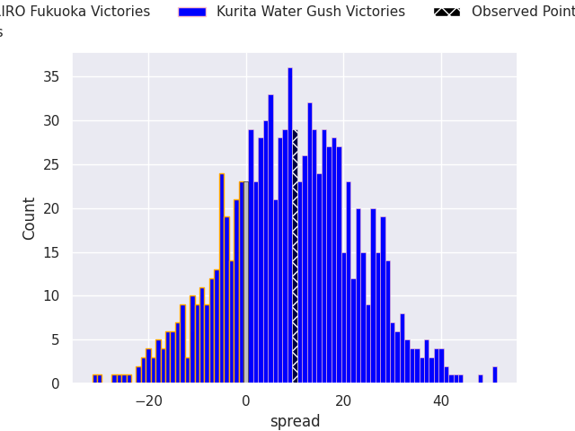
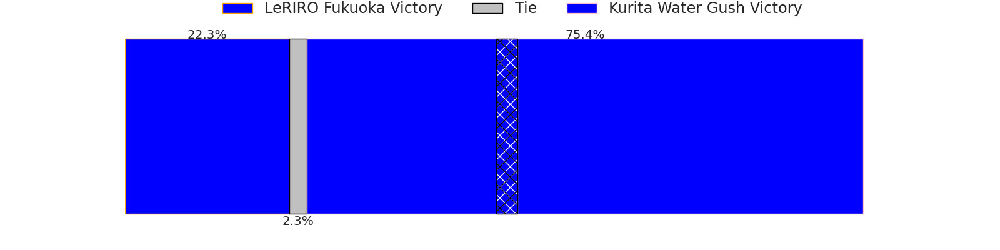
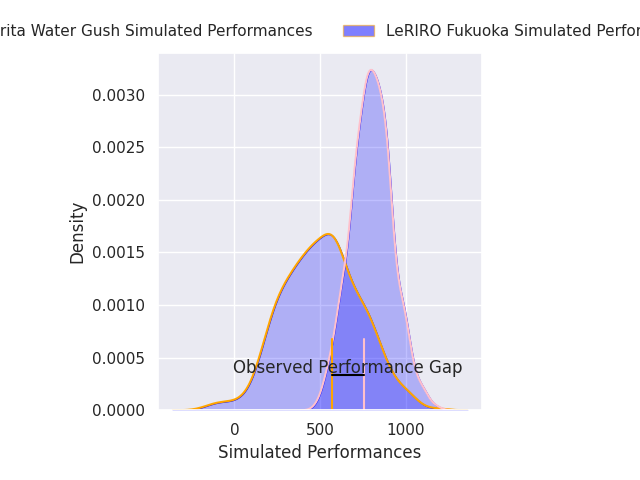
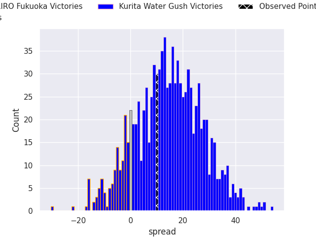
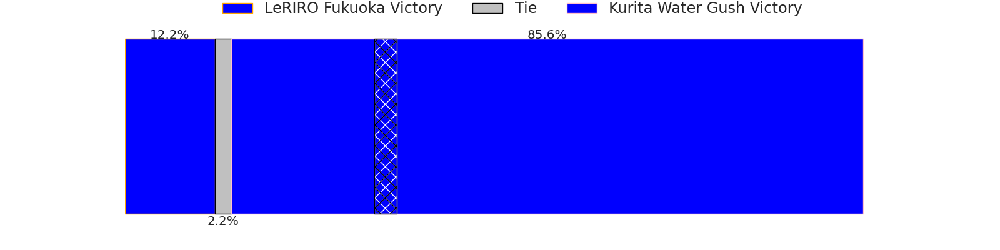

# LeRIRO Fukuoka V Kurita Water Gush on 2026/04/04, 34.0 to 44.0

# Club Level Predictions

Now that the game has been played, lets see how the club predictions did. I predicted Kurita Water Gush to win by 9.59, and Kurita Water Gush won by 10.0. That's an absolute error of 0.4 for the margin of victory, while my average absolute error has been 13.7 over the past six months. This prediction was more accurate than 97.4% of my recent predictions.

For the Over/Under model, I predicted a total of 53.5 and we have an actual total of 78.0. That's an absolute error of 24.5 compared to a six month average of 13.2. This prediction was more accurate than 15.8% of my recent predictions.
## Projected Performances - Club Model

## Projected Spreads - Club Model

## Projected Results - Club Model

# Player Level Predictions

With the player model, I predicted Kurita Water Gush to win by 14.56,  and Kurita Water Gush won by 10.0. That's an absolute error of 4.6 for the margin of victory, while the average error as been 13.8 for the past six months. So this prediction was more accurate than 70.5% of my recent predictions.
## Projected Performances - Player Model

## Projected Spreads - Player Model

## Projected Results - Player Model

