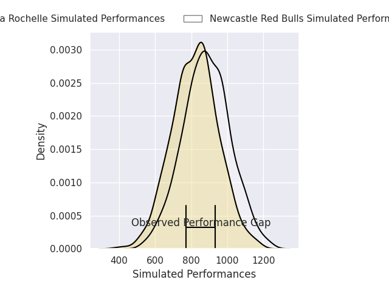
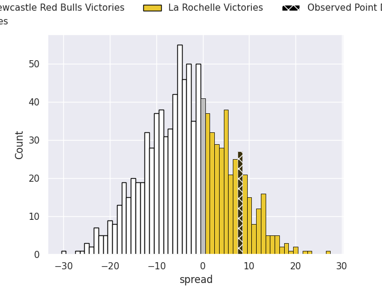
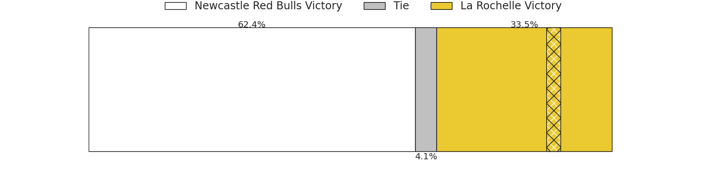

# Newcastle Red Bulls V La Rochelle on 2026/04/04, 18.0 to 26.0

# Club Level Predictions

Now that the game has been played, lets see how the club predictions did. I predicted La Rochelle to win by 3.7, and La Rochelle won by 8.0. That's an absolute error of 4.3 for the margin of victory, while my average absolute error has been 13.7 over the past six months. This prediction was more accurate than 78.4% of my recent predictions.

For the Over/Under model, I predicted a total of 44.5 and we have an actual total of 44.0. That's an absolute error of 0.5 compared to a six month average of 13.2. This prediction was more accurate than 97.2% of my recent predictions.
## Projected Performances - Club Model

## Projected Spreads - Club Model

## Projected Results - Club Model

# Player Level Predictions

With the player model, I predicted Newcastle Red Bulls to win by 3.16,  and La Rochelle won by 8.0. That's an absolute error of 11.2 for the margin of victory, while the average error as been 13.8 for the past six months. So this prediction was more accurate than 42.7% of my recent predictions.
## Projected Performances - Player Model

## Projected Spreads - Player Model

## Projected Results - Player Model

