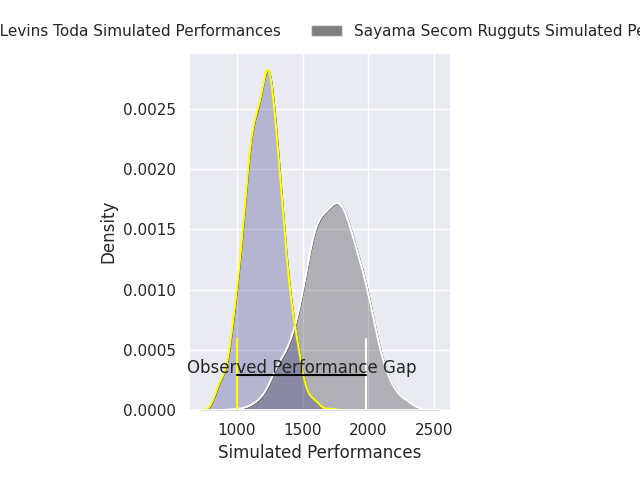
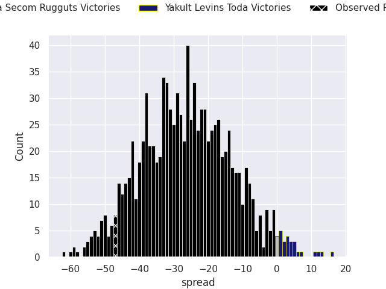
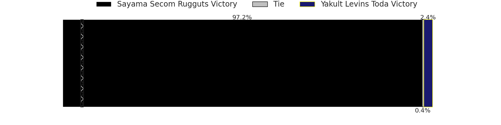
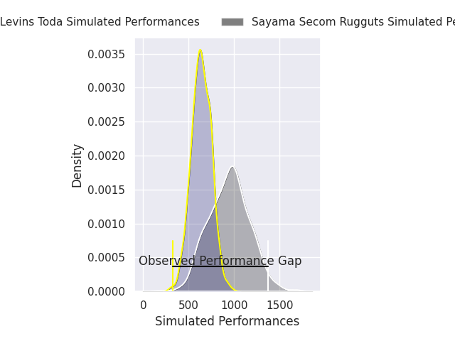
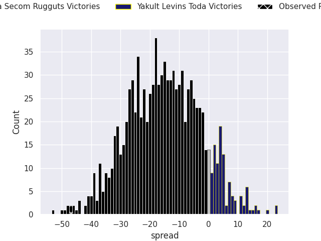
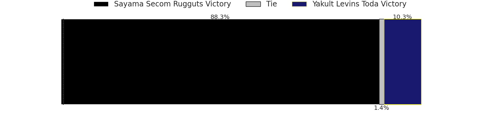

# Sayama Secom Rugguts V Yakult Levins Toda on 2026/04/04, 47.0 to 0.0

# Club Level Predictions

Now that the game has been played, lets see how the club predictions did. I predicted Sayama Secom Rugguts to win by 26.32, and Sayama Secom Rugguts won by 47.0. That's an absolute error of 20.7 for the margin of victory, while my average absolute error has been 13.7 over the past six months. This prediction was more accurate than 22.4% of my recent predictions.

For the Over/Under model, I predicted a total of 50.5 and we have an actual total of 47.0. That's an absolute error of 3.5 compared to a six month average of 13.2. This prediction was more accurate than 83.0% of my recent predictions.
## Projected Performances - Club Model

## Projected Spreads - Club Model

## Projected Results - Club Model

# Player Level Predictions

With the player model, I predicted Sayama Secom Rugguts to win by 15.29,  and Sayama Secom Rugguts won by 47.0. That's an absolute error of 31.7 for the margin of victory, while the average error as been 13.8 for the past six months. So this prediction was more accurate than 8.7% of my recent predictions.
## Projected Performances - Player Model

## Projected Spreads - Player Model

## Projected Results - Player Model

