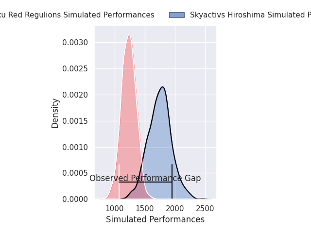
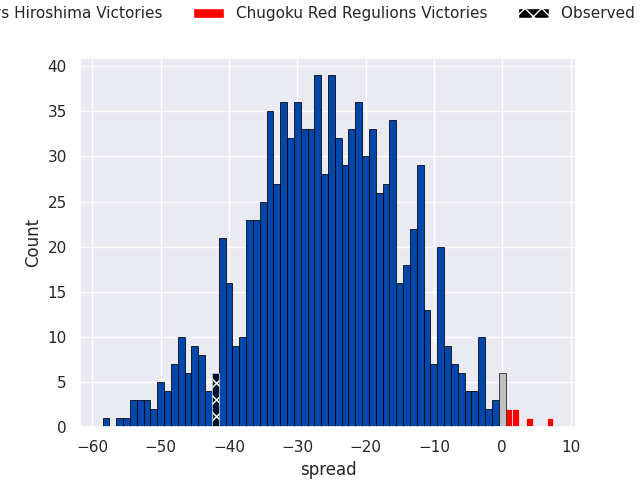
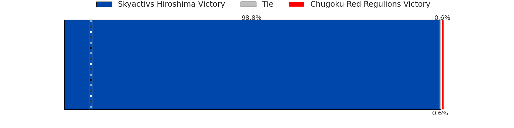
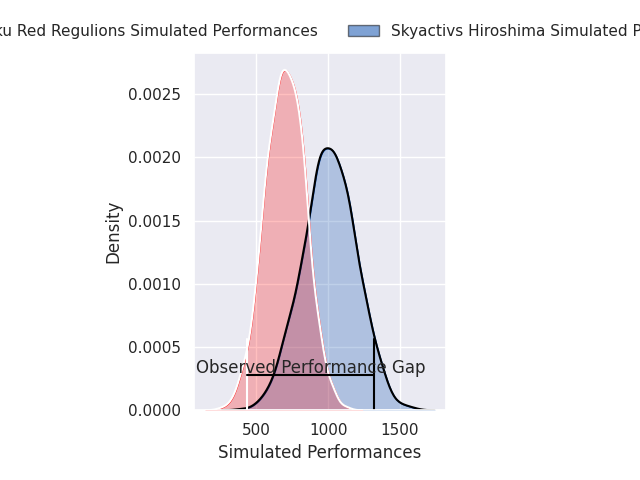
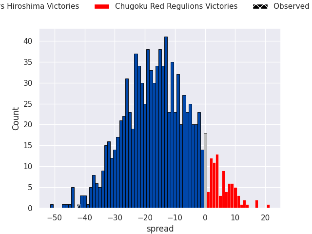
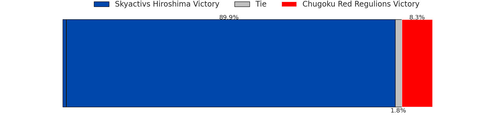

# Skyactivs Hiroshima V Chugoku Red Regulions on 2026/04/04, 49.0 to 7.0

# Club Level Predictions

Now that the game has been played, lets see how the club predictions did. I predicted Skyactivs Hiroshima to win by 25.53, and Skyactivs Hiroshima won by 42.0. That's an absolute error of 16.5 for the margin of victory, while my average absolute error has been 13.7 over the past six months. This prediction was more accurate than 31.2% of my recent predictions.

For the Over/Under model, I predicted a total of 50.5 and we have an actual total of 56.0. That's an absolute error of 5.5 compared to a six month average of 13.2. This prediction was more accurate than 72.9% of my recent predictions.
## Projected Performances - Club Model

## Projected Spreads - Club Model

## Projected Results - Club Model

# Player Level Predictions

With the player model, I predicted Skyactivs Hiroshima to win by 15.39,  and Skyactivs Hiroshima won by 42.0. That's an absolute error of 26.6 for the margin of victory, while the average error as been 13.8 for the past six months. So this prediction was more accurate than 12.7% of my recent predictions.
## Projected Performances - Player Model

## Projected Spreads - Player Model

## Projected Results - Player Model

