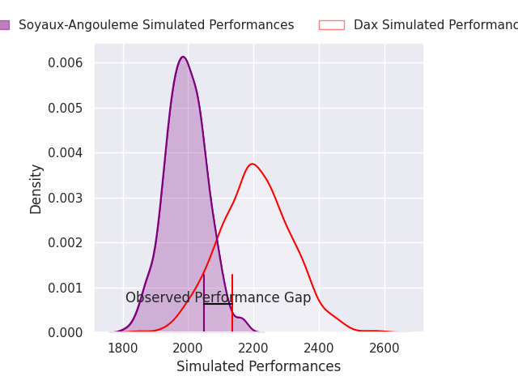
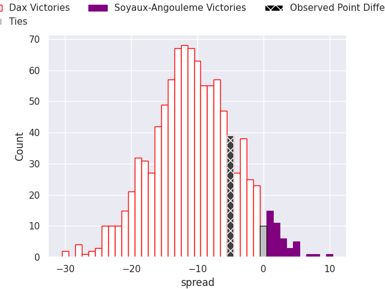
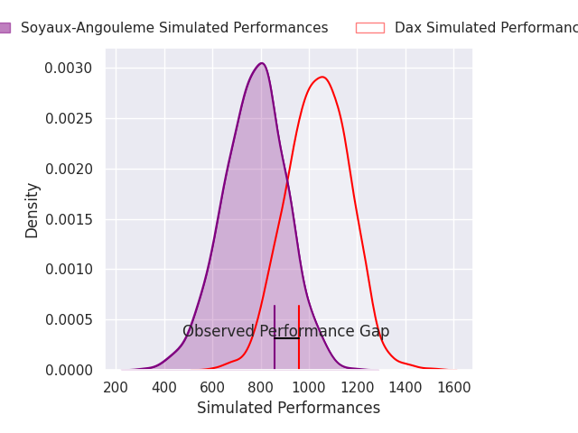
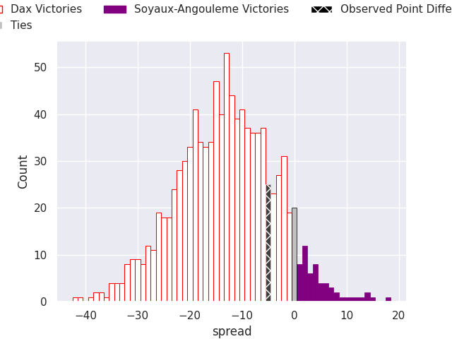
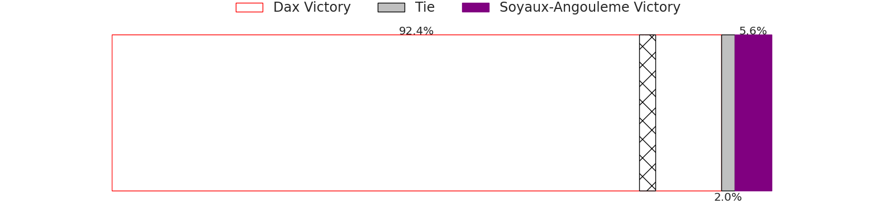

# Dax V Soyaux-Angouleme on 2026/04/10, 22.0 to 17.0

# Club Level Predictions

Now that the game has been played, lets see how the club predictions did. I predicted Dax to win by 10.62, and Dax won by 5.0. That's an absolute error of 5.6 for the margin of victory, while my average absolute error has been 13.7 over the past six months. This prediction was more accurate than 71.3% of my recent predictions.

For the Over/Under model, I predicted a total of 46.5 and we have an actual total of 39.0. That's an absolute error of 7.5 compared to a six month average of 13.3. This prediction was more accurate than 62.7% of my recent predictions.
## Projected Performances - Club Model

## Projected Spreads - Club Model

## Projected Results - Club Model

# Player Level Predictions

With the player model, I predicted Dax to win by 13.23,  and Dax won by 5.0. That's an absolute error of 8.2 for the margin of victory, while the average error as been 13.9 for the past six months. So this prediction was more accurate than 53.9% of my recent predictions.
## Projected Performances - Player Model

## Projected Spreads - Player Model

## Projected Results - Player Model

