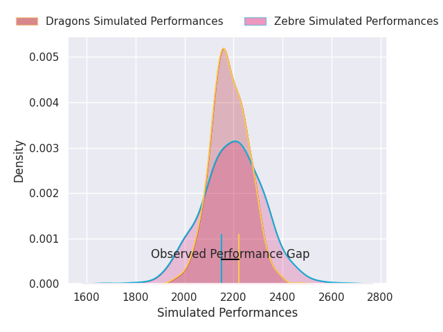
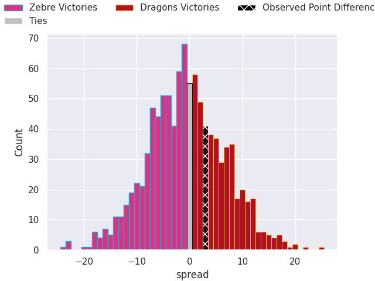
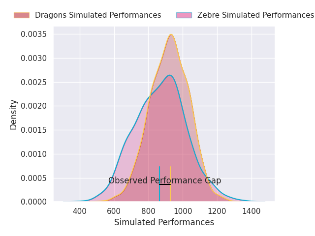
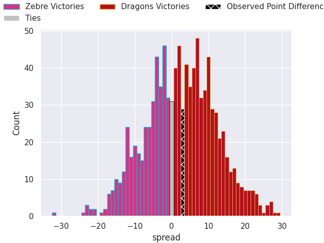

# Zebre V Dragons on 2026/04/11, 32.0 to 35.0

# Club Level Predictions

Now that the game has been played, lets see how the club predictions did. I predicted Zebre to win by 0.62, and Dragons won by 3.0. That's an absolute error of 3.6 for the margin of victory, while my average absolute error has been 13.7 over the past six months. This prediction was more accurate than 81.4% of my recent predictions.

For the Over/Under model, I predicted a total of 46.5 and we have an actual total of 67.0. That's an absolute error of 20.5 compared to a six month average of 13.3. This prediction was more accurate than 23.4% of my recent predictions.
## Projected Performances - Club Model

## Projected Spreads - Club Model

## Projected Results - Club Model

# Player Level Predictions

With the player model, I predicted Dragons to win by 2.56,  and Dragons won by 3.0. That's an absolute error of 0.4 for the margin of victory, while the average error as been 13.9 for the past six months. So this prediction was more accurate than 89.2% of my recent predictions.
## Projected Performances - Player Model

## Projected Spreads - Player Model

## Projected Results - Player Model

