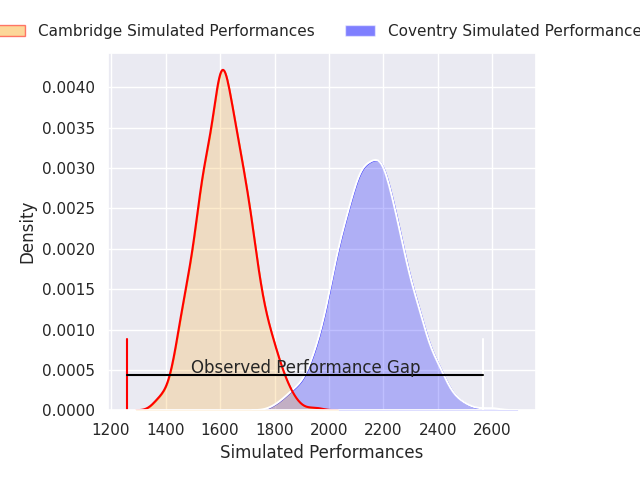
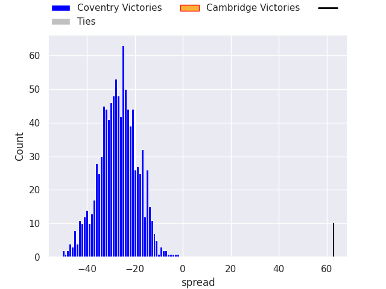
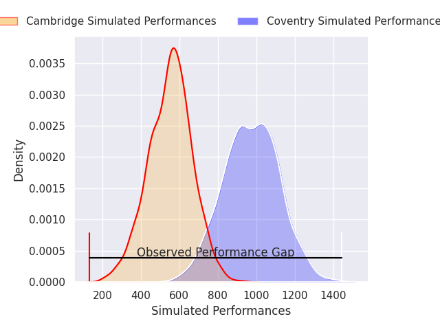
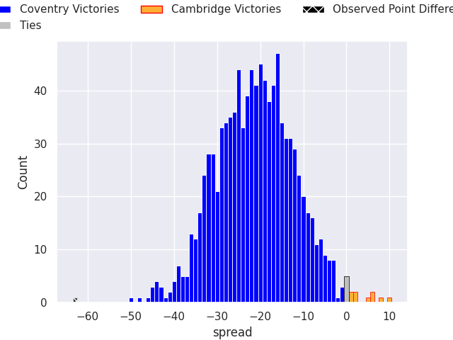

# Coventry V Cambridge on 2026/04/17, 77.0 to 14.0

# Club Level Predictions

Now that the game has been played, lets see how the club predictions did. I predicted Coventry to win by 27.03, and Coventry won by 63.0. That's an absolute error of 36.0 for the margin of victory, while my average absolute error has been 14.0 over the past six months. This prediction was more accurate than 6.4% of my recent predictions.

For the Over/Under model, I predicted a total of 51.5 and we have an actual total of 91.0. That's an absolute error of 39.5 compared to a six month average of 13.6. This prediction was more accurate than 1.8% of my recent predictions.
## Projected Performances - Club Model

## Projected Spreads - Club Model

## Projected Results - Club Model

# Player Level Predictions

With the player model, I predicted Coventry to win by 21.06,  and Coventry won by 63.0. That's an absolute error of 41.9 for the margin of victory, while the average error as been 14.0 for the past six months. So this prediction was more accurate than 3.1% of my recent predictions.
## Projected Performances - Player Model

## Projected Spreads - Player Model

## Projected Results - Player Model

