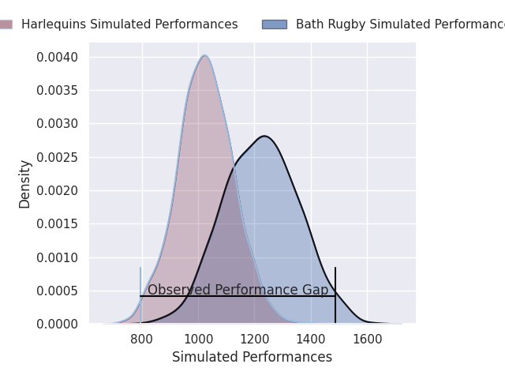
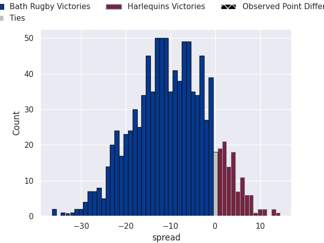
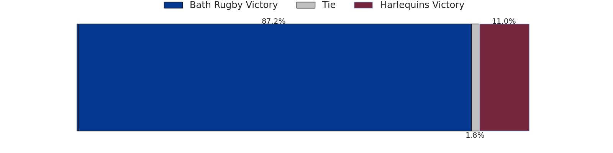

# Bath Rugby V Harlequins on 2026/04/18, 48.0 to 15.0

# Club Level Predictions

Now that the game has been played, lets see how the club predictions did. I predicted Bath Rugby to win by 13.4, and Bath Rugby won by 33.0. That's an absolute error of 19.6 for the margin of victory, while my average absolute error has been 14.0 over the past six months. This prediction was more accurate than 24.8% of my recent predictions.

For the Over/Under model, I predicted a total of 49.5 and we have an actual total of 63.0. That's an absolute error of 13.5 compared to a six month average of 13.6. This prediction was more accurate than 41.2% of my recent predictions.
## Projected Performances - Club Model

## Projected Spreads - Club Model

## Projected Results - Club Model

# Player Level Predictions

With the player model, I predicted Bath Rugby to win by 9.91,  and Bath Rugby won by 33.0. That's an absolute error of 23.1 for the margin of victory, while the average error as been 14.0 for the past six months. So this prediction was more accurate than 16.6% of my recent predictions.
## Projected Performances - Player Model

## Projected Spreads - Player Model

## Projected Results - Player Model

