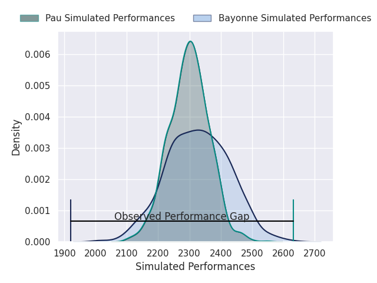
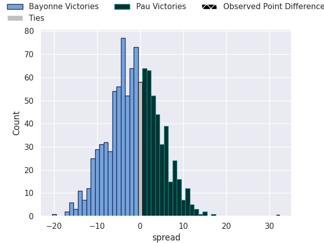
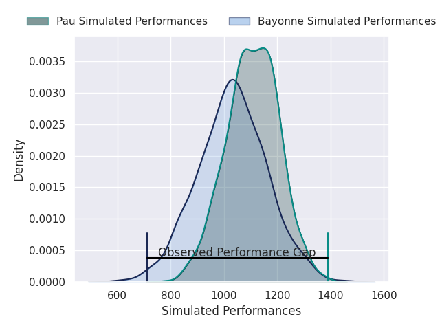
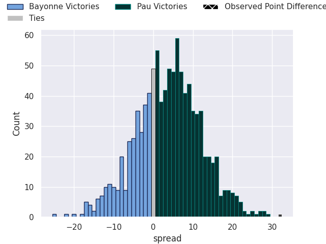

# Bayonne V Pau on 2026/04/18, 22.0 to 54.0

# Club Level Predictions

Now that the game has been played, lets see how the club predictions did. I predicted Bayonne to win by 1.44, and Pau won by 32.0. That's an absolute error of 33.4 for the margin of victory, while my average absolute error has been 14.0 over the past six months. This prediction was more accurate than 8.2% of my recent predictions.

For the Over/Under model, I predicted a total of 49.5 and we have an actual total of 76.0. That's an absolute error of 26.5 compared to a six month average of 13.6. This prediction was more accurate than 13.2% of my recent predictions.
## Projected Performances - Club Model

## Projected Spreads - Club Model

## Projected Results - Club Model

# Player Level Predictions

With the player model, I predicted Pau to win by 3.83,  and Pau won by 32.0. That's an absolute error of 28.2 for the margin of victory, while the average error as been 14.0 for the past six months. So this prediction was more accurate than 11.3% of my recent predictions.
## Projected Performances - Player Model

## Projected Spreads - Player Model

## Projected Results - Player Model

