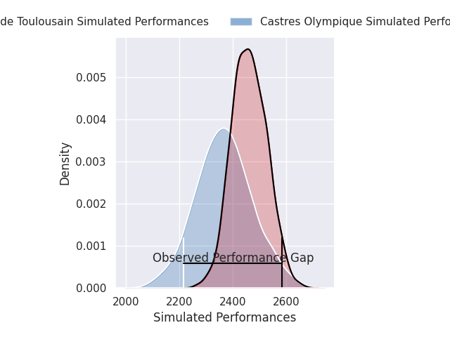
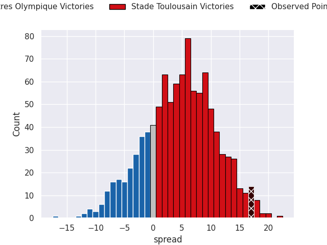
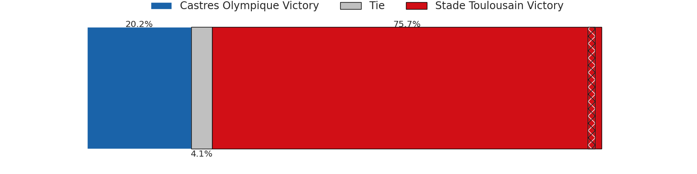
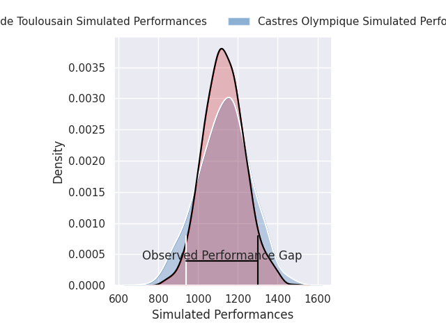
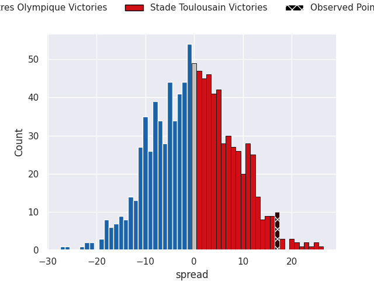
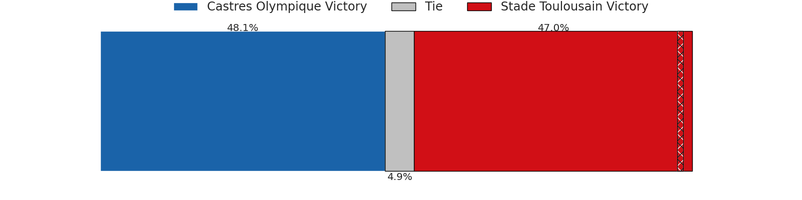

# Castres Olympique V Stade Toulousain on 2026/04/18, 25.0 to 42.0

# Club Level Predictions

Now that the game has been played, lets see how the club predictions did. I predicted Stade Toulousain to win by 4.71, and Stade Toulousain won by 17.0. That's an absolute error of 12.3 for the margin of victory, while my average absolute error has been 14.0 over the past six months. This prediction was more accurate than 43.4% of my recent predictions.

For the Over/Under model, I predicted a total of 49.5 and we have an actual total of 67.0. That's an absolute error of 17.5 compared to a six month average of 13.6. This prediction was more accurate than 30.0% of my recent predictions.
## Projected Performances - Club Model

## Projected Spreads - Club Model

## Projected Results - Club Model

# Player Level Predictions

With the player model, I predicted Castres Olympique to win by 0.03,  and Stade Toulousain won by 17.0. That's an absolute error of 17.0 for the margin of victory, while the average error as been 14.0 for the past six months. So this prediction was more accurate than 26.2% of my recent predictions.
## Projected Performances - Player Model

## Projected Spreads - Player Model

## Projected Results - Player Model

