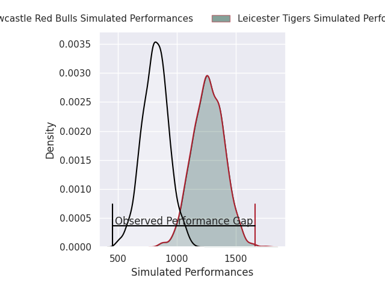
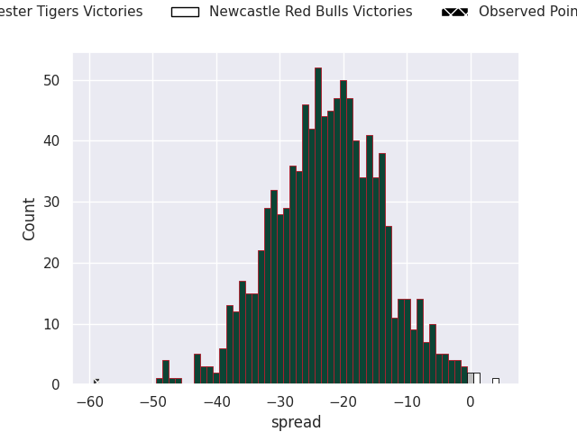
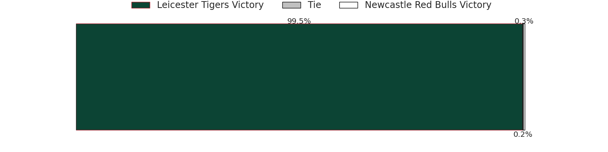

# Leicester Tigers V Newcastle Red Bulls on 2026/04/18, 62.0 to 3.0

# Club Level Predictions

Now that the game has been played, lets see how the club predictions did. I predicted Leicester Tigers to win by 20.33, and Leicester Tigers won by 59.0. That's an absolute error of 38.7 for the margin of victory, while my average absolute error has been 14.0 over the past six months. This prediction was more accurate than 5.4% of my recent predictions.

For the Over/Under model, I predicted a total of 46.5 and we have an actual total of 65.0. That's an absolute error of 18.5 compared to a six month average of 13.6. This prediction was more accurate than 28.1% of my recent predictions.
## Projected Performances - Club Model

## Projected Spreads - Club Model

## Projected Results - Club Model

# Player Level Predictions

With the player model, I predicted Leicester Tigers to win by 22.48,  and Leicester Tigers won by 59.0. That's an absolute error of 36.5 for the margin of victory, while the average error as been 14.0 for the past six months. So this prediction was more accurate than 5.7% of my recent predictions.
## Projected Performances - Player Model

## Projected Spreads - Player Model

## Projected Results - Player Model

