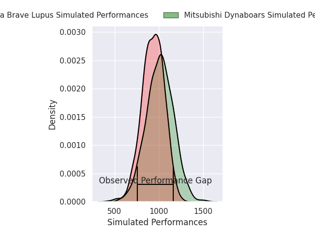
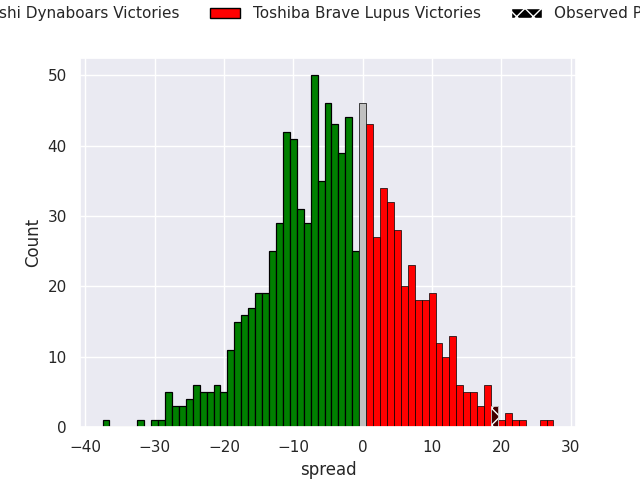
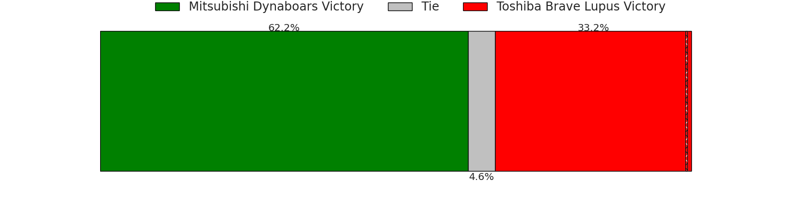

# Mitsubishi Dynaboars V Toshiba Brave Lupus on 2026/04/18, 26.0 to 45.0

# Club Level Predictions

Now that the game has been played, lets see how the club predictions did. I predicted Toshiba Brave Lupus to win by 0.35, and Toshiba Brave Lupus won by 19.0. That's an absolute error of 18.6 for the margin of victory, while my average absolute error has been 14.0 over the past six months. This prediction was more accurate than 26.7% of my recent predictions.

For the Over/Under model, I predicted a total of 52.5 and we have an actual total of 71.0. That's an absolute error of 18.5 compared to a six month average of 13.6. This prediction was more accurate than 28.1% of my recent predictions.
## Projected Performances - Club Model

## Projected Spreads - Club Model

## Projected Results - Club Model

# Player Level Predictions

With the player model, I predicted Mitsubishi Dynaboars to win by 3.66,  and Toshiba Brave Lupus won by 19.0. That's an absolute error of 22.7 for the margin of victory, while the average error as been 14.0 for the past six months. So this prediction was more accurate than 17.0% of my recent predictions.
## Projected Performances - Player Model

## Projected Spreads - Player Model

## Projected Results - Player Model

