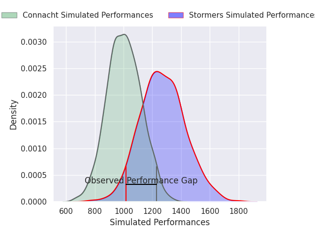
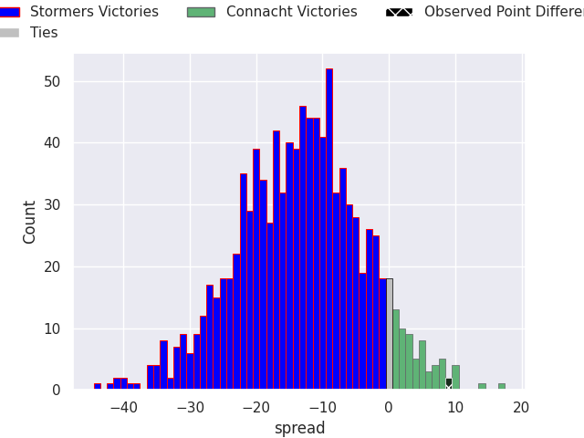
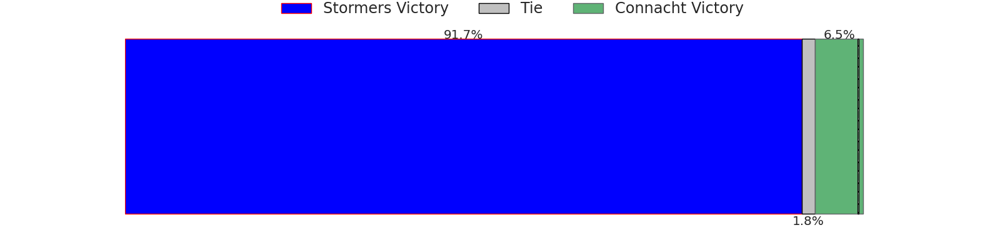

# Stormers V Connacht on 2026/04/18, 24.0 to 33.0

# Club Level Predictions

Now that the game has been played, lets see how the club predictions did. I predicted Stormers to win by 7.16, and Connacht won by 9.0. That's an absolute error of 16.2 for the margin of victory, while my average absolute error has been 14.0 over the past six months. This prediction was more accurate than 32.8% of my recent predictions.

For the Over/Under model, I predicted a total of 46.5 and we have an actual total of 57.0. That's an absolute error of 10.5 compared to a six month average of 13.6. This prediction was more accurate than 52.0% of my recent predictions.
## Projected Performances - Club Model

## Projected Spreads - Club Model

## Projected Results - Club Model

# Player Level Predictions

With the player model, I predicted Stormers to win by 13.37,  and Connacht won by 9.0. That's an absolute error of 22.4 for the margin of victory, while the average error as been 14.0 for the past six months. So this prediction was more accurate than 17.5% of my recent predictions.
## Projected Performances - Player Model

## Projected Spreads - Player Model

## Projected Results - Player Model

