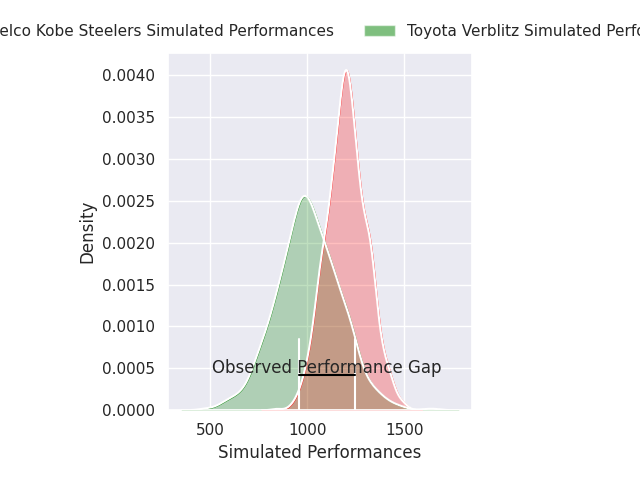
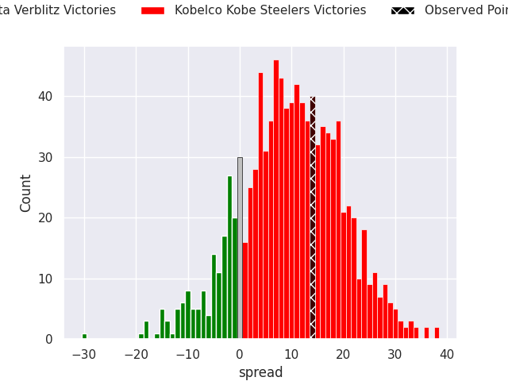
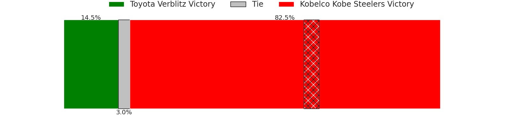

# Toyota Verblitz V Kobelco Kobe Steelers on 2026/04/18, 24.0 to 38.0

# Club Level Predictions

Now that the game has been played, lets see how the club predictions did. I predicted Kobelco Kobe Steelers to win by 9.18, and Kobelco Kobe Steelers won by 14.0. That's an absolute error of 4.8 for the margin of victory, while my average absolute error has been 13.8 over the past six months. This prediction was more accurate than 75.8% of my recent predictions.

For the Over/Under model, I predicted a total of 53.5 and we have an actual total of 62.0. That's an absolute error of 8.5 compared to a six month average of 13.4. This prediction was more accurate than 60.2% of my recent predictions.
## Projected Performances - Club Model

## Projected Spreads - Club Model

## Projected Results - Club Model

# Player Level Predictions

With the player model, I predicted Kobelco Kobe Steelers to win by 9.82,  and Kobelco Kobe Steelers won by 14.0. That's an absolute error of 4.2 for the margin of victory, while the average error as been 13.9 for the past six months. So this prediction was more accurate than 69.5% of my recent predictions.
## Projected Performances - Player Model

## Projected Spreads - Player Model

## Projected Results - Player Model

