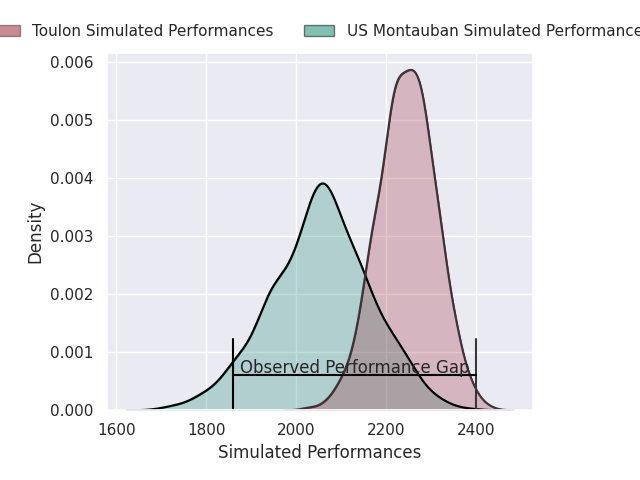
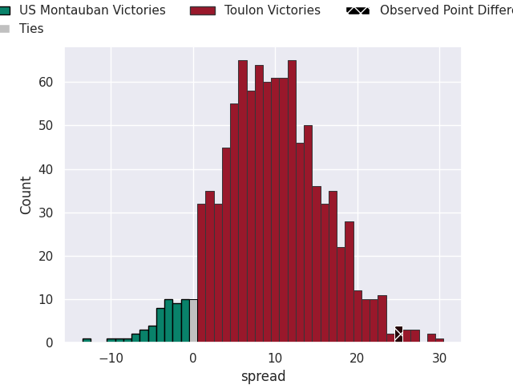
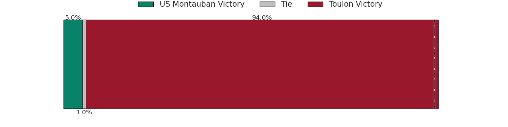
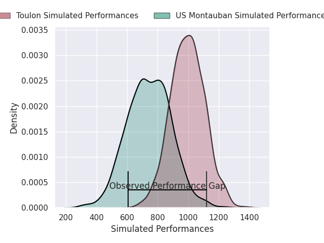
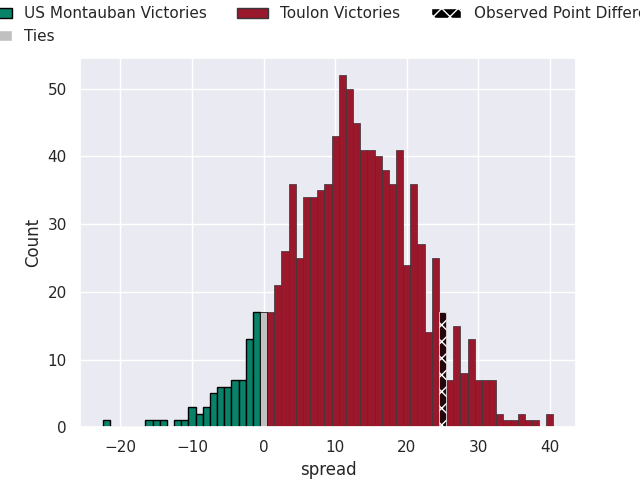
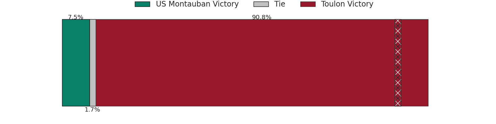

# US Montauban V Toulon on 2026/04/18, 22.0 to 47.0

# Club Level Predictions

Now that the game has been played, lets see how the club predictions did. I predicted Toulon to win by 9.57, and Toulon won by 25.0. That's an absolute error of 15.4 for the margin of victory, while my average absolute error has been 14.0 over the past six months. This prediction was more accurate than 34.6% of my recent predictions.

For the Over/Under model, I predicted a total of 50.5 and we have an actual total of 69.0. That's an absolute error of 18.5 compared to a six month average of 13.6. This prediction was more accurate than 28.1% of my recent predictions.
## Projected Performances - Club Model

## Projected Spreads - Club Model

## Projected Results - Club Model

# Player Level Predictions

With the player model, I predicted Toulon to win by 12.56,  and Toulon won by 25.0. That's an absolute error of 12.4 for the margin of victory, while the average error as been 14.0 for the past six months. So this prediction was more accurate than 37.3% of my recent predictions.
## Projected Performances - Player Model

## Projected Spreads - Player Model

## Projected Results - Player Model

