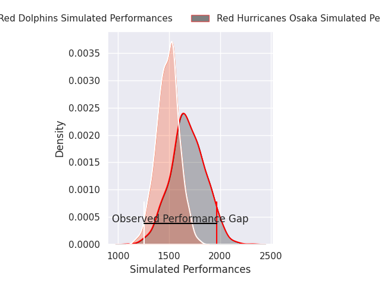
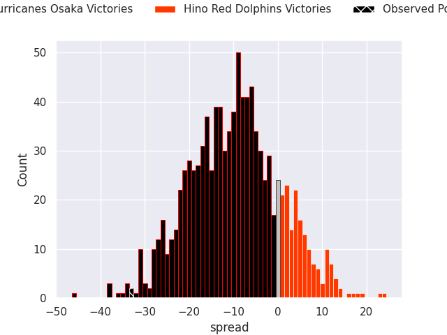
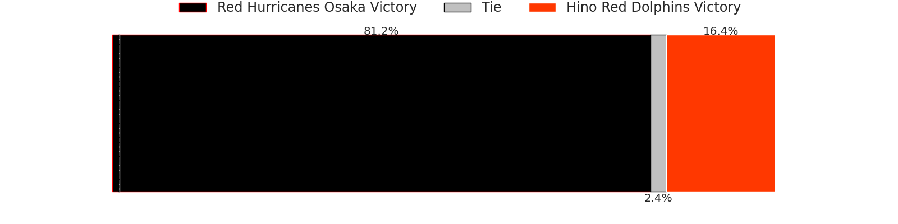

# Red Hurricanes Osaka V Hino Red Dolphins on 2026/04/24, 59.0 to 26.0

# Club Level Predictions

Now that the game has been played, lets see how the club predictions did. I predicted Red Hurricanes Osaka to win by 9.79, and Red Hurricanes Osaka won by 33.0. That's an absolute error of 23.2 for the margin of victory, while my average absolute error has been 14.0 over the past six months. This prediction was more accurate than 18.7% of my recent predictions.

For the Over/Under model, I predicted a total of 44.5 and we have an actual total of 85.0. That's an absolute error of 40.5 compared to a six month average of 13.6. This prediction was more accurate than 1.5% of my recent predictions.
## Projected Performances - Club Model

## Projected Spreads - Club Model

## Projected Results - Club Model

